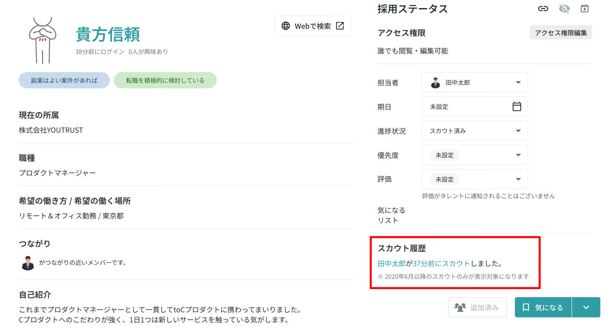
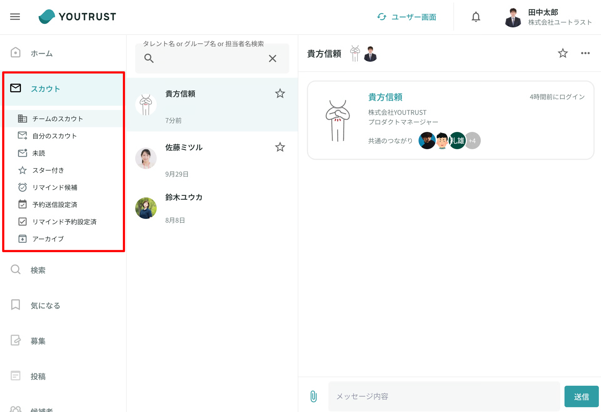

# リクルーター権限の各役割の違いについて知りたい

リクルーターチームには**「オーナー」「メンバー」「アシスタント」「つながりサポーター」**の4つの役割がございます。

チームメンバーに追加する際に、各メンバーに合わせて役割を設定いただけます。

役割の変更は、管理画面「設定 > メンバー管理」より行えます。

## 役割の詳細

**▼役割ごとにご利用可能な機能一覧**

| 役割名称 | オーナー | メンバー | アシスタント | つながりサポーター |
| --- | --- | --- | --- | --- |
| リクルーター管理画面へのアクセス（公式リクルーターバッチの表示） | ◯ | ◯ | ◯ | × |
| タレントの検索 | ◯ | ◯ | ◯ | × |
| タレントの採用ステータスの変更 | ◯ | ◯ | ◯ | × |
| タレントの社内メモへの記載 | ◯ | ◯ | ◯ | × |
| 気になるリストの作成・編集・削除 | ◯ | ◯ | ◯ | × |
| 気になるリストへのタレントの追加・移動・削除 | ◯ | ◯ | ◯ | × |
| 候補者へのタレント追加・アーカイブ | ◯ | ◯ | ◯ | × |
| カンパニーページの作成・編集 | ◯ | ◯ | ◯ | × |
| スカウトの送信 | ◯ | ◯ | × | × |
| チームの他リクルーターのスカウト履歴(※1)の閲覧 | ◯ | ◯ | ◯ | × |
| チームの他リクルーターのスカウト内容(メッセージ内容)(※2)の閲覧 | ◯ | × | × | × |
| リクルーターの追加・編集・削除(※3) | ◯ | × | × | × |

- ※1
    - 「オーナー」「メンバー」「アシスタント」の場合、同じ所属の公式リクルーター全員の**スカウト履歴**の閲覧が可能です。
    - タレント詳細画面（オーナー）
        { width="70%" style="display: block; margin: 0 auto;" }
        - 該当のスカウトルームへのリンクが表示され、スカウトルーム(メッセージ内容)の閲覧が可能です。
    - タレント詳細画面（メンバー・アシスタント）
        
        - 該当のスカウトルームへのリンクが表示されません。
    - 検索画面（オーナー・メンバー・アシスタント）
        
- ※2
    - 「オーナー」の場合
        - 「チームのスカウト」が表示
        - 同じ所属の公式リクルーター全員の**スカウトルーム(グループスカウトルームを含むメッセージ内容)の閲覧**が可能
    - 「メンバー」「アシスタント」の場合
        - 「チームのスカウト」が表示されない
        - 同じ所属の他公式リクルーターの**スカウトルーム(グループスカウトルームを含むメッセージ内容)の閲覧不可**
    - スカウトルーム一覧画面（オーナー）
        
    - スカウトルーム一覧画面（メンバー・アシスタント）
        
        - 自身が送付したスカウトのみ閲覧可能です。
- ※3
    - リクルーター権限付与可能人数の上限までであれば、自由な役割の組み合わせで役割を設定いただくことが可能です。
    - （各企業には**1人以上のオーナーがいることが必須**となります。）

### **つながりサポーターをご登録する際の注意点**

- 「つながりサポーター」に登録されたユーザーの「2次つながり」まで同チームのリクルーターからアプローチ可能でございます。
- 「つながりサポーター」の方が受け取る意欲変更通知は、リクルーターチーム参加前と変わらず、ご自身の友達の範囲が対象となります。
- 「つながりサポーター」に登録されたユーザーはサービス画面上では、登録前と登録後変化がないため、チームメンバーに登録されていることを認識しずらい場合がございますので、ご注意ください。

ご不明点がございましたら、担当のCSまでお問い合わせください。

[公式リクルーター権限の追加方法を知りたい](add-recruiter.md)
