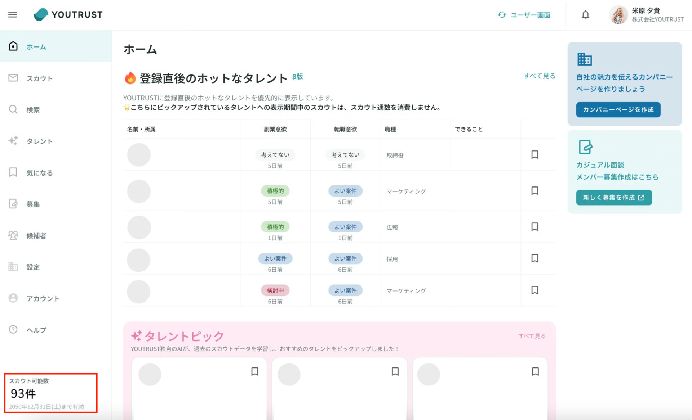

# :material-counter: 送付可能なスカウト通数を確認したい

## スカウト通数の確認方法

- リクルーター管理画面左下に送付可能な残りスカウト数が表示・確認できます。
    - 契約プランに応じて、スカウト通数と有効期限は異なります。
- リクルーター管理画面は、公式リクルーター権限をもつ方のみ閲覧できます。
- リクルータ権限の設定は、こちらのページをご覧ください。

※スカウト数の単位は、**1人あたり1通**のカウントです。リマインド等**1人に複数回メッセージを送った場合でも、1通としてカウントされます**のでご安心ください。

[契約内容を確認したい](../billing/check-contract.md)

[追加購入したスカウトを契約更新後に持ち越したい](../billing/carryover-scout.md)
