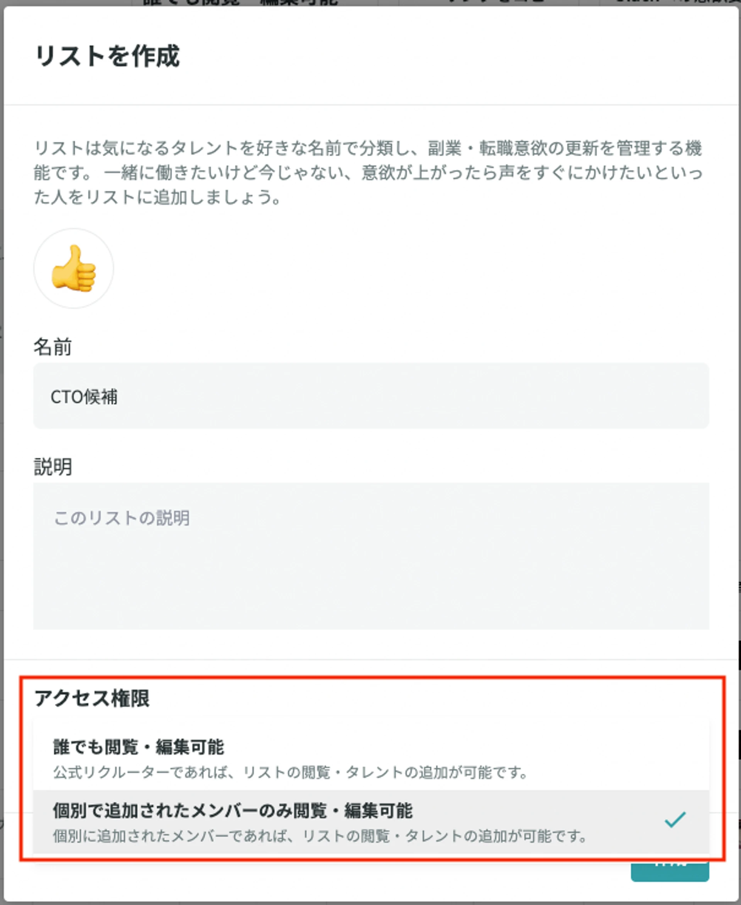
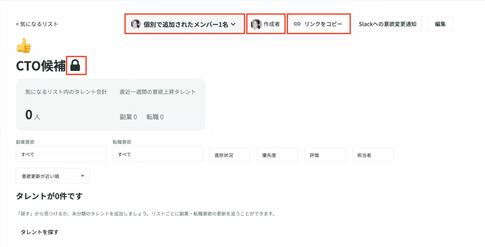
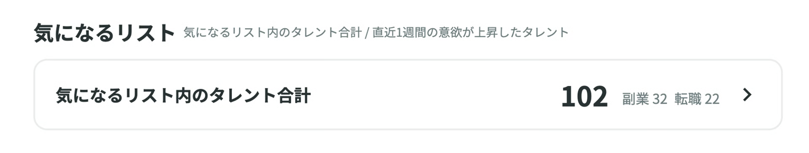

# 気になるリストのアクセスを管理したい

**気になるリストのアクセス権限の管理が可能でございます。**

社内にはクローズドにしたいポジションのタレントプールとして、採用し得る候補者の情報を管理することができます。

!!! tip "例"
    「役員候補のタレントプールを運用したいけど、マネージャーだけが見れるようにしたい」など

アクセスできるメンバーに登録された**特定のメンバーだけが該当の気になるリストの閲覧・編集が可能です。**

## 気になるリストにアクセス制限をつけるには？

リクルーター管理画面「気になるリスト」から通常通りリスト作成を行います。

リスト作成画面にて「アクセス権限」を設定できますので、こちらから**「個別で追加されたメンバーのみ閲覧・編集可能」を選択**します。

{ width="90%" style="display: block; margin: 0 auto;" }

下記画像のようになっていれば、アクセスが制限されている状態です。

- **リスト名の最後に鍵マークがついている**
- **「個別で追加されたメンバー数」の表示がある**

アクセス権限を設定すると、Slack通知連携が解除されますので、お手数ですが、再度Slack通知連携をお願いいたします。

Slackへの連携方法は下記をご確認ください。

[Slackに通知を連携したい](../notification/slack-integration.md)

## **アクセスできるメンバーの設定方法**

該当リストの上部「個別で追加されたメンバー」もしくは「編集」からリストの編集画面を開きます。

「メンバー」からアクセスできるメンバーを追加して、更新をクリックして完了です。

### プライベートリストにアクセスできない時

!!! warning "注意"
    - リストのアクセス権限を持たないメンバーがリンクから直接開いた際は、「このリストは非公開です」と表示されます。

- 自分がアクセスできないリストへの追加・削除のログは表示されません。
- ホームの気になるリスト集計に自分がアクセスでないリストに追加のタレントは対象は集計されません。

- 自分がアクセスできないリストのタレントは気になるリストの「すべて」に表示されません。

- 検索の「気になるリスト追加済みタレントを除く」フィルターは自分がアクセスできるリストに追加されているタレントを除きます。
- タレントの気になるリスト追加ボタンは自分がアクセスできるリストに追加されている場合に表示が「追加済み」に変わります。

    ※自分がアクセスできないリストに追加されている場合は、未追加時の表示です。
