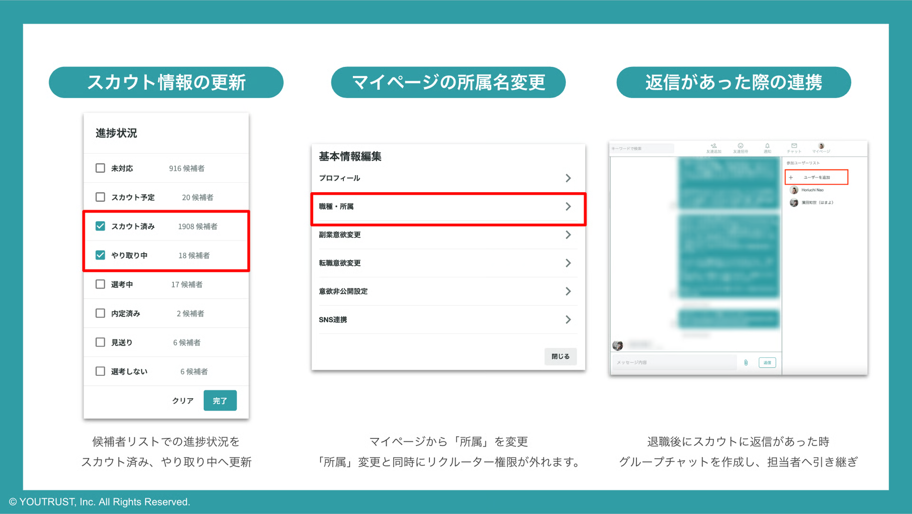

# :material-account-arrow-right: リクルーターが退職後の候補者管理について知りたい

公式リクルーターとして、スカウト活動をしていた方がご退職や休職などの際には、スカウトに返信があった際のオペレーションを会社様ごとにご検討いただく必要がございます。

現在、YOUTRUSTとして推奨しているオペレーションは下記でございますので、参考にしていただけますと幸いです。

## ご退職者様にご対応いただくこと

### 1. ご自身がスカウトを送った方の進捗状況の更新

リクルーター管理画面の「[候補者](https://youtrust.jp/recruiter_team/candidates)」リストにて、「担当者」をご自身で絞り込みます。

スカウトに未返信の方は「スカウト済み」、すでに返信をいただいている方は「やり取り中」に進捗状況を更新します。

### 2. ご自身のマイページの所属名を変更

マイページの編集にて、所属名をご変更をお願いいたします。

所属名を変更しますと同時に、自動的に公式リクルーター権限が解除されます。

これ以降、リクルーター管理画面へのアクセスができなくなりますので、ご留意ください。

### 3. 過去のスカウトに返信があった際の対応

ご転職後に送付済みスカウトに返信があった際は、元々所属していた企業のリクルーターの方とグループチャットで繋いでいただくことをオススメしております。

候補者様にとって、ご退職されていることをキャッチアップするのは難しいため、お手数をおかけいたしますが、よろしくお願いいたします。

グループチャットの作成方法は下記ページをご覧ください。

[グループチャットを作りたい](../communication/group-chat.md)
