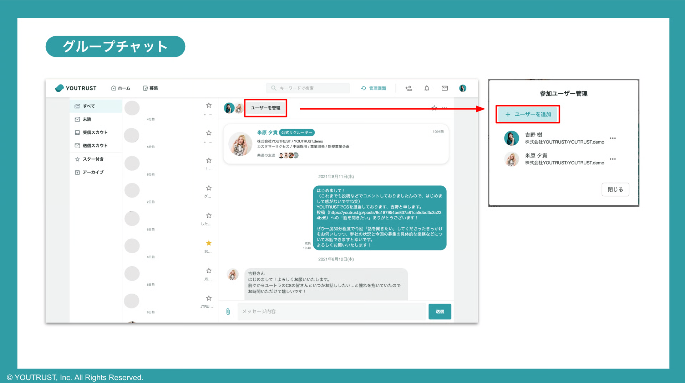
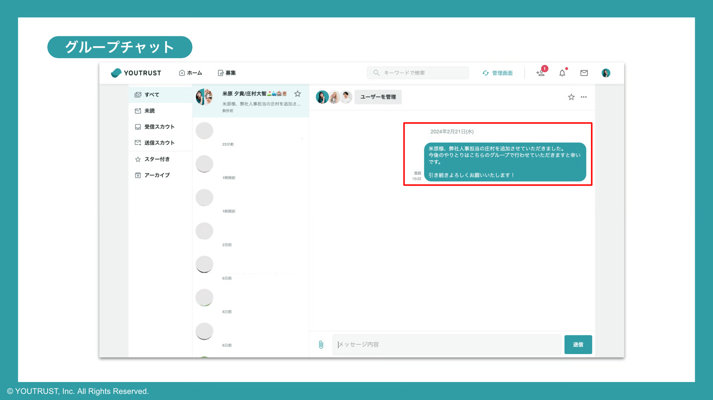

# :material-chat-plus-outline: グループチャット/グループスカウトを作りたい

以下の条件に該当すれば、グループチャット/グループスカウトを作成することができます。

- グループチャット：**「つながり(友達)**」を追加できる。リクルーター管理画面で**管理できない。**
- グループスカウト：「**同じリクルーターチームのリクルーター**」を追加できる。リクルーター管理画面で**管理できる。**

※リクルーター権限がついていない社内のユーザーを追加したい場合、下記のどちらかの対応をいただく必要がございます。

- 追加したい社内のユーザーにリクルーター権限をつける（ =グループスカウト作成可能）
- スカウト対象のユーザーとつながる（＝グループチャット作成可能）

### 共通条件

- **返信のあった**チャットルームであること
    - 相手から返信がない状態ではグループチャットを作成することはできません

### 手順

1. 返信のあったメッセージルームのメニューバーに「ユーザーを管理」が表示されます
2. 「+ユーザーを追加」からご自身のつながりのユーザーを追加できます
    

3. ユーザーを追加すると、新たに3人のグループチャットが立ち上がります
4. グループチャットを作成した人が、１通目のメッセージを送ります【作成完了】

    メッセージを送らないまま他ページに遷移などすると、グループチャットは作成未完了の状態です。

    **必ずメッセージを送信し、グループチャットが作成完了できたことを確認してください。**

    また、グループチャットには、それまでの2名間のやりとりは引き継がれません。ご注意ください。

    
