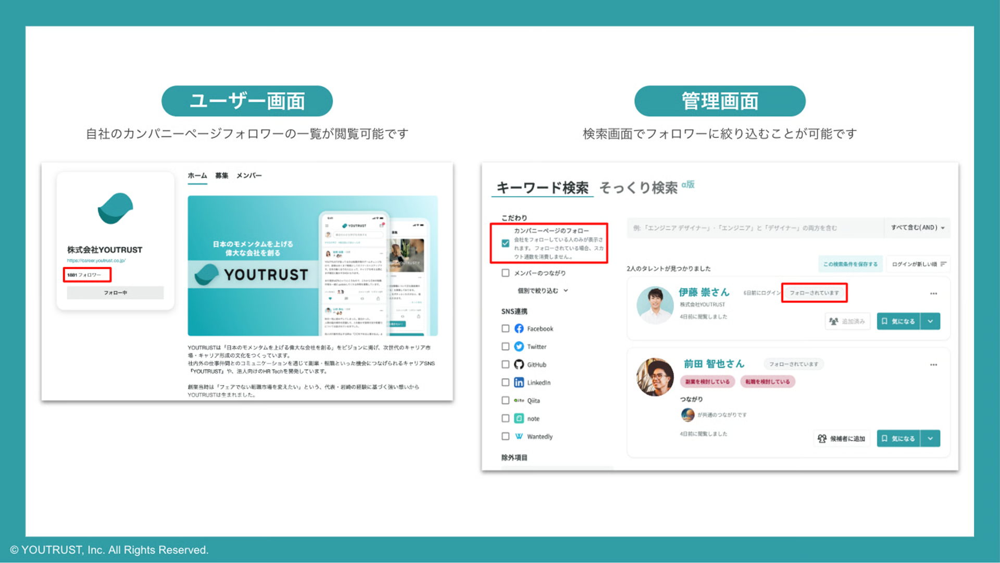
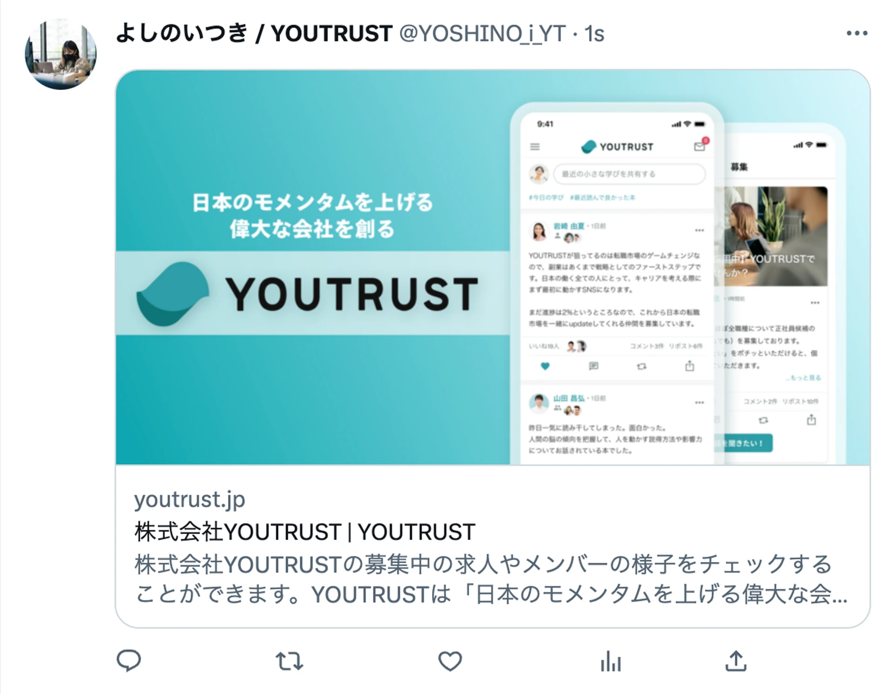

# :material-account-heart-outline: カンパニーページのフォロワーについて知りたい

## :material-check-circle-outline: フォロワーに対してできること

カンパニーページのフォロワーには、つながりの範囲に関係なく、

カンパニーページのメンバーに登録されたリクルーターから**スカウトが可能です**。（スカウト数を消費しません）

カンパニーページのフォロワーを増やすことで、2次のつながりを超えた範囲でスカウト対象者を広げることができます。

また、カンパニーページのフォロワーは自社に興味を持っている可能性が高く、スカウトの返信率も高くなる傾向があります。

## :material-trending-up: フォロワーの増やし方

### :material-link-variant: YOUTRUSTサービス内での導線を利用する

サービス内でのカンパニーページへのフォロー導線を随時強化しております。

PC web、アプリ共に募集からのカンパニーページフォローの流入が見込めます。

### :material-share-variant-outline: 他SNSでカンパニーページURLを拡散する

カンパニーページのOGPは各企業のカバー画像が表示されます。

今後、SNSへの拡散がしやすいような開発も予定しておりますので、それまでは直接URLの拡散をおすすめいたします！

{ width="70%" style="display: block; margin: 0 auto;" }
