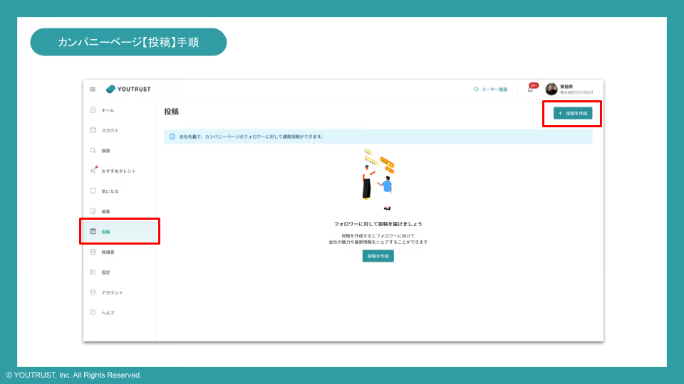
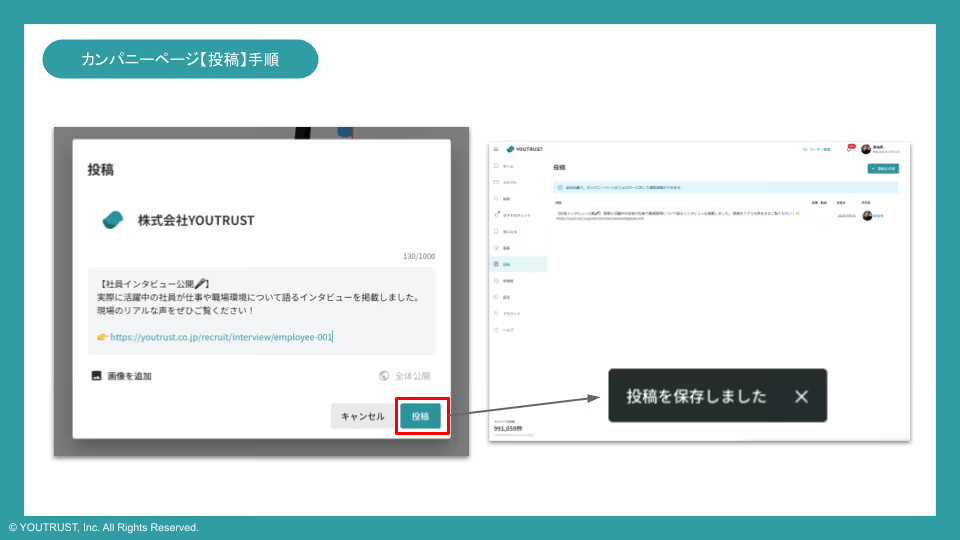
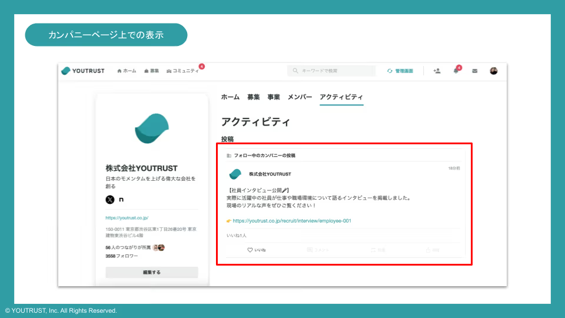

# カンパニーページのフォロワーへ会社名義で通常投稿したい

## カンパニーページの投稿機能について

**カンパニーページのフォロワーに対して、社内の日頃の様子やイベント情報など、自社の最新情報の発信ができる機能**です。

[リクルーター管理画面の投稿](https://admin.youtrust.jp/recruiter_team/recruiter_team_posts)から、作成・管理ができます。投稿一覧は、同じ所属の自分以外の公式リクルーターの投稿も表示されます。

## 投稿手順

1. サイドバーの「投稿」をクリックし、投稿ページを表示
2. 右上の新規投稿ボタンから、投稿を作成
  
3. 投稿文を作成し、投稿ボタンをクリック
4. ページ下部に「投稿を保存しました」のメッセージが表示されたら、投稿完了
  

※URLにはリンクがつきます。

※画像投稿も可能です。

※動画の投稿はできません。

**※カンパニーページのフォロワーのタイムラインに表示**されます。

※カンパニーページのアクティビティにも投稿が表示されます。

## 投稿の編集・削除

[リクルーター管理画面の投稿](https://admin.youtrust.jp/recruiter_team/recruiter_team_posts)から、投稿の編集・削除ができます。

※タイムライン上では、編集・削除はできません。

※投稿の編集、削除は作成者本人しか出来ません。

1. 編集・削除したい投稿を選択
  

2. 右上のボタンから投稿の「削除」をクリックで投稿を削除、「更新」をクリックで投稿内容の修正が可能

※画像は後から追加・編集・削除はできかねますので、画像を追加したい場合は、新規投稿をお願いします。

## カンパニーページ上での表示

カンパニーページ内、アクティビティのタイムライン上に表示されます。

## ユーザー側の表示

カンパニーページのフォロワーのタイムライン上に表示されます。

