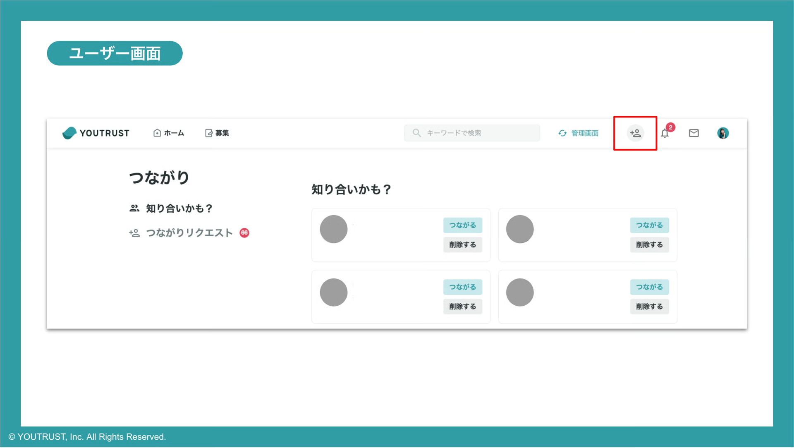
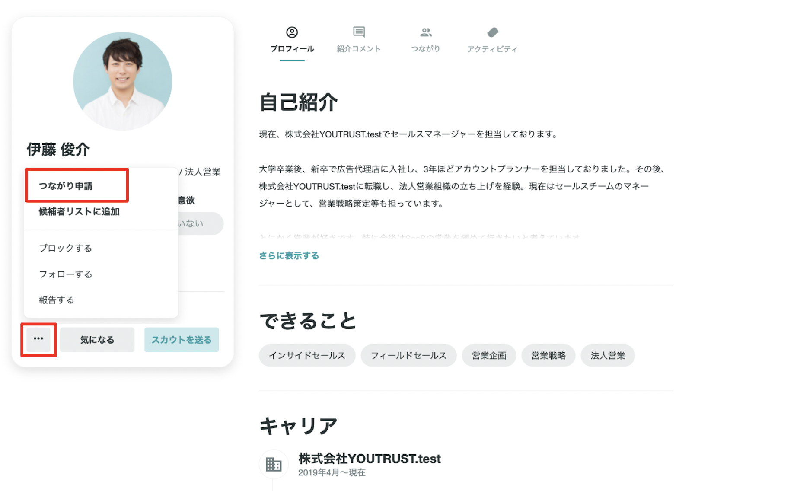

# つながりを増やしたい

YOUTRUSTで友達を増やすには3つの方法があります。

# つながり候補から探す

- 登録完了後は、[つながりタブ](https://youtrust.jp/friend_candidates)から友達候補を確認することができます。
- Facebook連携やプロフィールに過去の経歴を入力をすると、つながり候補が自動的に増えていきます。また、友人・同僚がYOUTRUSTに新しく登録すると、同じくつながり候補として表示されます。

# プロフィールページから「つながり申請」をする

- つながりたい人のプロフィールページの三点リーダーから「つながり申請」のボタンを押すと、つながり申請ができます。承認されるとYOUTRUST上で友達になります。

全く知らない人からの友達申請が大量に届かないための仕様として、一部つながり申請に制限がございます。
