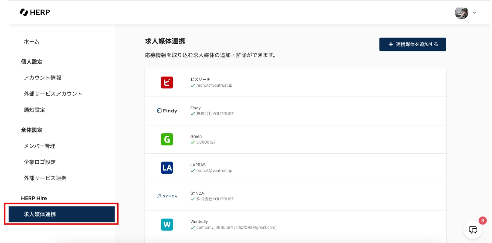
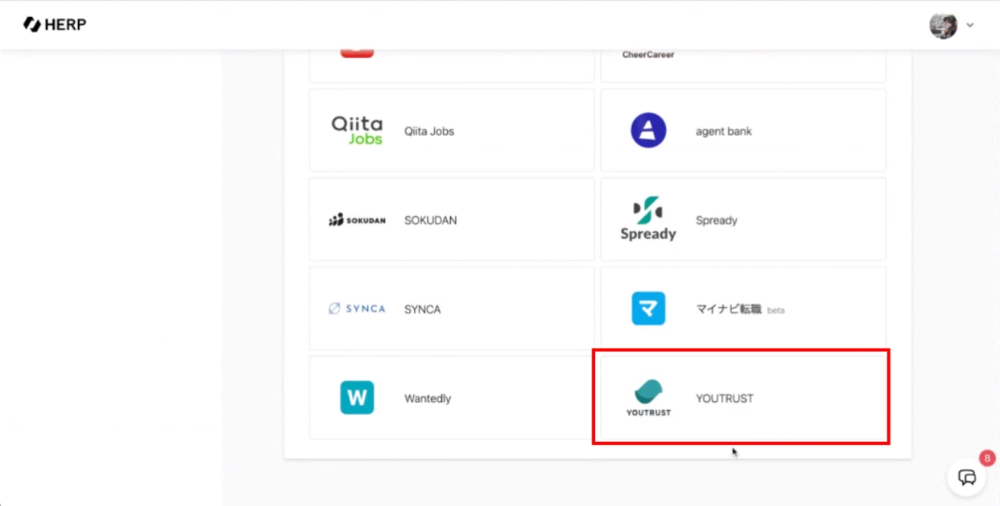

# :material-connection: HERP Hireとの連携

## 連携の方法

HERP連携をするためには、HERP画面、YOUTRUSTのリクルーター管理画面の両方で操作を行う必要があります。

### HERP画面での操作

①**HERPホーム＞求人媒体連携**を選択

**②YOUTRUSTを選択**

③**YOUTRUSTと媒体連携する**の画面から**「媒体連携トークンを発行する」**を選択し、媒体連携トークンを取得する

　

### YOUTRUSTのリクルーター管理画面での操作

①**YOUTRUSTリクルーター管理画面＞[設定](https://youtrust.jp/recruiter_team/settings)＞外部サービス連携＞HERP連携**の「webhookトークン」欄に取得した媒体連携トークンを入力する

