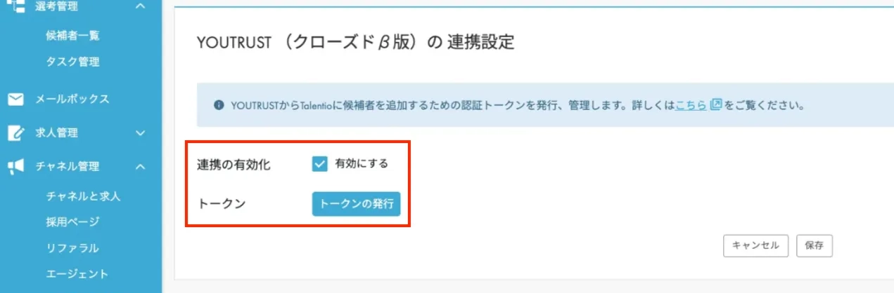
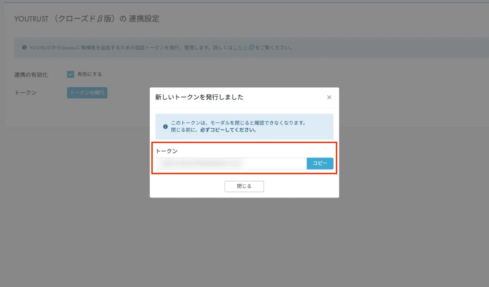
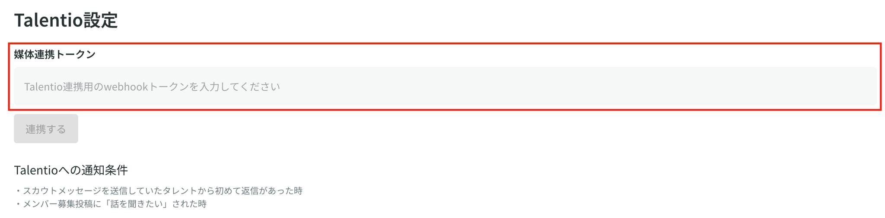

# :material-connection: Talentioとの連携

## 連携の方法

Talentio連携をするためには、Talentio画面、YOUTRUSTのリクルーター管理画面の両方で操作を行う必要があります。

### Talentio画面での操作

**①Talentioホーム＞左メニュー＞各種設定＞採用媒体**を選択

②**YOUTRUSTを選択**

③YOUTRUST連携設定の「**有効にする**」にチェックを入れ、「**トークンを発行**」を押下する

④表示されたトークンをコピーする

### **YOUTRUSTのリクルーター管理画面での操作**

①**YOUTRUSTリクルーター管理画面＞[設定](https://youtrust.jp/recruiter_team/settings)＞外部サービス連携＞Talentio**の「webhookトークン」欄に取得した媒体連携トークンを入力する

※Talentio連携をするためにはBusinessプラン以上のご契約が必要となります。
