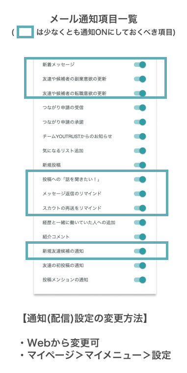

# :material-bell-ring-outline: サービス内の通知について知りたい

### 通知される項目

メール・アプリ・Slackに通知される項目は、それぞれ別に設定・変更ができます。

### メール通知項目
{ width="50%" style="display: block; margin: 0 auto;" }

### アプリ通知項目
{ width="50%" style="display: block; margin: 0 auto;" }

### リクルーター管理画面　通知項目

[Slackに通知を連携したい](slack-integration.md)
