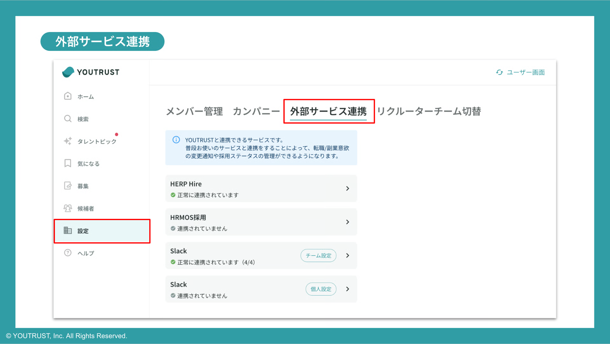
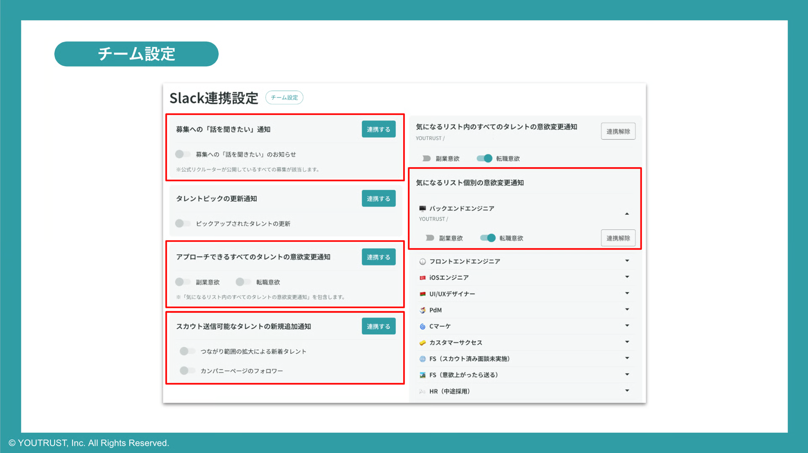

# :material-slack: Slackに通知を連携したい

[リクルーター管理画面の設定](https://youtrust.jp/recruiter_team/settings)「外部サービス連携」より、Slack連携が可能です。

Slack連携はチーム設定と個人設定があり、それぞれ連携できる項目が異なります。

通知項目はそれぞれ異なるSlackチャンネルへの連携が可能です。

## 1. 募集への「話を聞きたい」

自社のメンバーが公開している募集に応募があった際、Slackへ通知されます。

- 募集を公開しているリクルーター
- 「話を聞きたい」された募集（カジュアル面談/メンバー募集）
- 応募したタレント

のすべてを社内で可能ですが、応募したタレントへスカウトを消費せずにメッセージが可能なのは、募集公開している方のみです。

!!! info "通知条件"
    下記２点をどちらも満たすことが通知条件

    - **カンパニーページのメンバーとして表示されている**
    - **公式リクルーターが公開している募集**

## 2. スカウト範囲のタレントの意欲変更

**アプローチできるすべてのタレントの意欲変更通知** だけでなく、気になるリストに追加しているタレントが、副業・転職意欲を上昇更新したときに、個別で通知を受け取ることが可能です。

「連携する」ボタンより、個別のチャンネルを指定してご利用ください。

## 3. 採用ステータスの通知(個人設定)

自分が担当している（または社内メモを付けた）候補者の情報を、他のリクルーターが更新した時に通知を受け取ることが可能です。

自分が関与していない（＝自分が担当者に設定されていない、メモを残したりしていない）候補者に関しては、設定しても通知されませんのでご注意ください。

!!! warning "注意事項"
    社内向けメモに**選考結果の情報やチャットメッセージ等の個人情報が含まれる**場合があるため、
    適切なメンバーのみが受け取れるようご注意ください。
