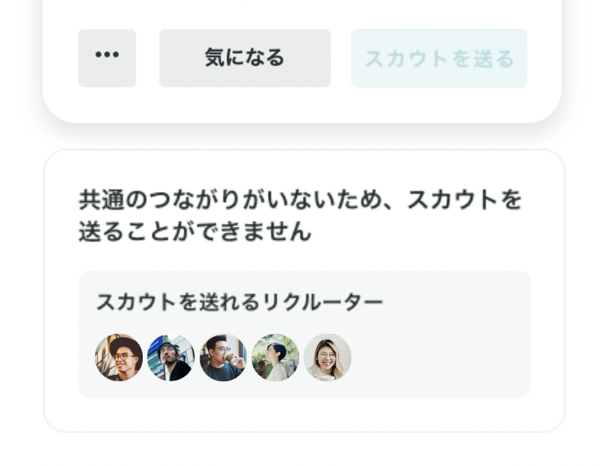
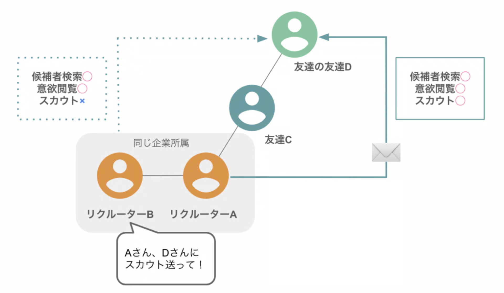

# :material-alert-outline: スカウトが送れないと表示される

下記のような表示が出るユーザーは、同所属のリクルーターの友達の友達（＝自分とは友達の友達の範囲の繋がりではないユーザー）でございます。

{ width="60%" style="display: block; margin: 0 auto;" }

ご契約いただいているプランによって解決方法が異なりますので、下記を参考にご対応ください。

## ライトプランの場合

自分からはスカウトが送れませんので、繋がりがあると表示されるリクルーターに、スカウトを送っていただくようにご依頼ください。

## スタンダード以上のプランの場合

対象のユーザーと友達の友達の関係にあるリクルーターと繋がることで、自分からもスカウトが送れるようになります。

表示されている同所属のリクルーターへつながり申請を送り、友達になってからスカウトを送りましょう。

[スカウトとメッセージの違いを知りたい](scout-vs-message.md)

[メッセージを送れる範囲について知りたい](message-scope.md)
