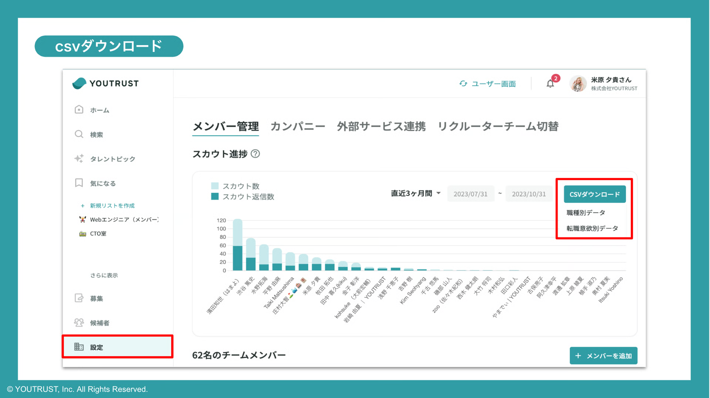

# :material-download-outline: スカウトデータをcsvダウンロードしたい

スカウト進捗のデータを管理画面からcsv形式でダウンロードが可能です。

1. 管理画面＞[設定](https://youtrust.jp/recruiter_team/settings)を開く
2. 期間を指定の上、職種別もしくは転職意欲別のデータをダウンロード

### :material-chart-bar: データの集計定義

- 送信数：指定期間中に送信したスカウト数
- 既読数：指定期間中に送信したスカウトのうち、現時点までに既読された数
- 返信数：指定期間中に送信したスカウトのうち、現時点までに返信された数
- 職種別データ
    - 各リクルーターから、どの職種の方に対して何通送ったか
- 転職意欲別データ
    - 各リクルーターから、どの転職意欲の方に対して何通送ったか
    - スカウトを受け取った日の転職意欲の集計
