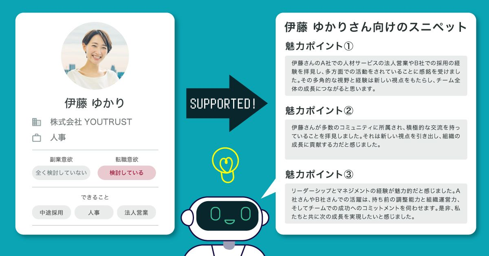

# さくさくメッセージビルダー(α版)について知りたい

## さくさくメッセージビルダー(α版)とは

スカウトの作成にかかる負担の軽減を目的とした、**AIが伴走するスカウト作成支援機能です。**

※2023年9月時点では、スカウトプランをご契約中の公式リクルーターが利用できます。

魅力的なスカウトを作成するために採用担当者の負担を少しでも減らすことを目的とした機能です。

「さくさくメッセージビルダー（α版）」はあくまでスカウトメッセージの作成を支援する機能であり、AIがすべての文章を作成するわけではありませんので、スカウトには最終的には各リクルーターの方々の思考や手が加わる前提のもと、AIとスニペットを組み合わせ、ご活用ください。

<!-- TODO: 動画埋め込む -->

## さくさくメッセージビルダー(α版)使い方

### 1. スカウトルームの「さくさくメッセージビルダー(α版)をつかう」をクリック

スカウトを送りたいタレントのプロフィール、もしくは管理画面からスカウトルームを開きます。

リクルーター管理画面では、スカウト作成時に候補者のプロフィールを閲覧しながら文章を作成できます。

リクルーター管理画面の「ホーム」「検索」「気になる」または「候補者」＞ 各ユーザー詳細ページ ＞ 「スカウト」ボタンを押下

さくさくメッセージビルダーが自動で起動しますので、スカウト作成時間の効率化につながります。

### 2. 「あなたのスニペット」を登録する

自己紹介や事業説明、募集している背景など、使用頻度の高いものを追加しましょう。

!!! tip "おすすめスニペット"
    - 自己紹介
    - 事業説明
    - 募集背景（ポジションごとにどんな課題があって採用しているのか書いてあるとGOOD）
    - 最後の締めの一言（日程調整など）
    - 返信がない場合のリマインド文言

### 3. 候補者のプロフィールからスニペットの自動生成

候補者のプロフィールから魅力的なポイントを3つ自動抽出されます。

最も訴求したいものを1〜2つ選択し、スカウト文作成の参考にしてみてください。

### 4. 「あなたのスニペット」と「候補者向けのスニペット」を組み合わせてスカウト文を作成する

「あなたのスニペット」にご自身で登録したもの、「候補者向けのスニペット」で自動生成されたものをクリックすると左側のメッセージ欄に文章が入力されます。

🔄ボタンをクリックすると、文章を再作成します。

AIに読み込ませているプロフィール情報は変わりませんので、大きく文章が変わることはございませんので、無闇な乱打などはお控えくださいませ。

!!! warning "最終確認はしっかりと行なってください"
    **スカウト内容について弊社では一切の責任を負いかねます。**

    誤字脱字や言い回しの違和感を調整をしてください。
    AIによるスニペットは日本語の違和感が残るものになっております。
    必ず、送信前に違和感がないか確認しましょう。
    「内容確認」ボタンを押すと最終確認の画面に遷移しますので、改めてスカウト文を確認しましょう。

!!! info "個人情報の取扱について"
    本機能ではバックエンドの一部に、
    マイクロソフト社が提供するクラウドサービスであるAzure OpenAI Serviceの
    Japan Eastリージョンを利用しており、プロフィール等のデータを暗号化した上で送信しております。
    送信されたデータは、
    本機能のみが利用するクローズドなモデルの学習（匿名化し活用）と
    不正監視以外の用途で保存されることも参照されることもございません。
    また、Azureにログインできるアカウントや権限に関しても、
    社内で定めたポリシーに従って厳重に管理しております。

    参考：[Azure OpenAI Serviceにおけるデータの取扱について](https://learn.microsoft.com/en-us/legal/cognitive-services/openai/data-privacy)
