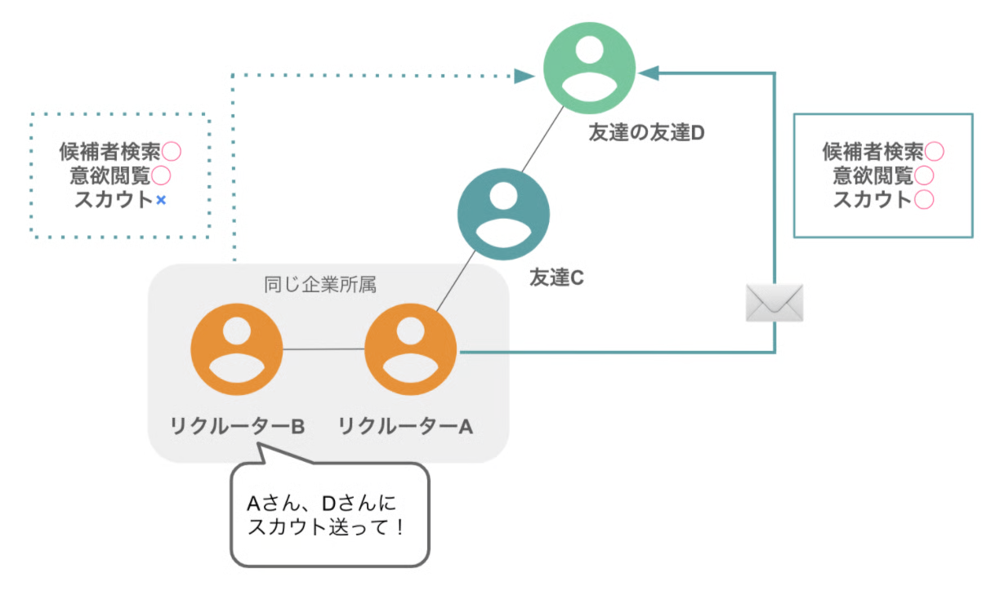

# スカウトとメッセージの違いを知りたい

YOUTRUSTには「メッセージルーム」と「スカウトルーム」が存在します。

|  | 送信範囲 | 管理画面での閲覧 | スカウト数の消費 |
| --- | --- | --- | --- |
| メッセージ | つながり | × | × |
|  | 募集への応募者 | × | × |
| 無料スカウト | つながり | ◯ | × |
|  | カンパニーページのフォロワー | ◯ | × |
|  | 登録直後のホットなタレント | ◯ | × |
|  | カンファレンス参加タレント | ◯ | × |
|  | 学生タレント | ◯ | × |
|  | 募集への応募者 | ◯ | × |
| 有料スカウト | 友達の友達（2次のつながり） | ◯ | ◯ |
|  | 同所属のリクルーターの友達の友達 | ◯ | ◯ |

各条件については下記をご確認くださいませ。

### メッセージ

- 「つながり」または「募集への応募者」へのメッセージ
    - 「つながり」へのメッセージはリクルーター管理画面には履歴が残らず、他のリクルーターからはメッセージのやり取りも閲覧できません

### 無料スカウト（通数を消費しない）

- 「つながり」へのスカウト
    - メッセージルームとスカウトルームのどちらかを選択できますが、どちらも通数を消費しません
    - スカウトルームで送ると、リクルーター管理画面に送信履歴が残り、他のリクルーターからも閲覧可能です
- 「カンパニーページをフォローしている人」へのスカウト
- 「登録直後のホットなタレント」へのスカウト
- YOUTRUSTが主催するカンファレンスに参加をしたタレント
- 学生タレント
- 募集への応募者

### 有料スカウト（通数を消費する）

- 「友達の友達」または「同所属のリクルーターの友達の友達（※）」へのメッセージ
    - プランごとに設けられているスカウト通数に影響する（＝利用するとスカウト残数が減る）

送付可能なスカウト通数は、管理画面から確認することができます。

※「同所属のリクルーターの友達の友達」へのスカウトは、**プレミアム / スタンダードプラス / スタンダードプラン**の企業のみがご利用いただける機能です。**ライトプラン**の企業では、「同所属のリクルーターの友達の友達」も検索したり、意欲を閲覧したりすることが可能ですが、スカウト送付は自分の「友達の友達」までとなっております。

### ライトプランの送付範囲

### スタンダードプラン以上の送付範囲

