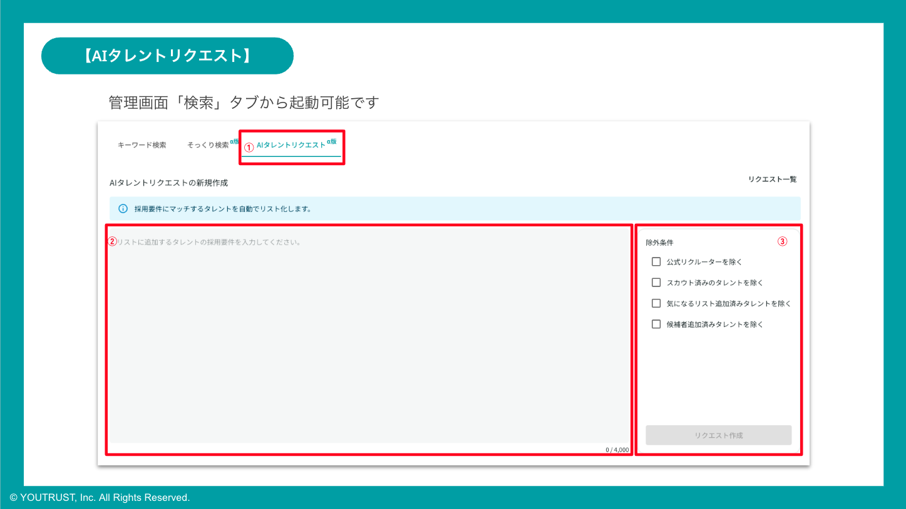
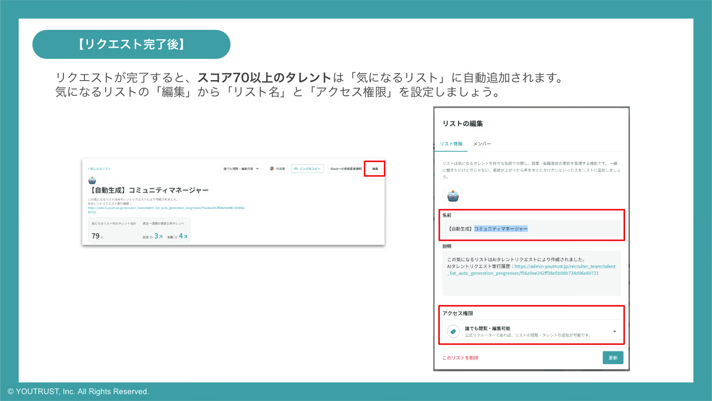

# :material-robot-outline: AIタレントリクエストについて知りたい

## :material-magnify: AIタレントリクエストで「探す」

1. リクルーター管理画面の[「検索」メニュー](https://admin.youtrust.jp/recruiter_team/search)から「AIタレントリクエスト」を選択

2. 募集要件やリストにしたいタレントイメージを自然言語(日本語など)で入力

3. 除外条件を設定し、「リクエスト作成」

※リクエスト作成から完了までは少々お時間をいただきます。

**Slack連携にて、完了通知を受け取ることも可能です。設定方法は下記「リクエスト完了をSlack通知で受け取りたい」をご確認ください。**

### :material-check-circle-outline: リクエストが完了したら

自動的にスコア70以上のタレントが「気になるリスト」に自動で新規作成+追加されます。

自動生成リストはデフォルトでアクセス権限が実行者のみに制限されていますので、必要に応じて下記の対応をお願いいたします。

1. 自動生成されたリストの編集を選択

2. リストの名前の変更

3. リストのアクセス権限を変更

### :material-star-half-full: AIによるスコアと評価コメント

AIによるプロフィールの要約とピックアップ理由である評価コメントはタレントごとに「社内メモ」に記載されます。

## :material-slack: リクエスト完了をSlack通知で受け取りたい

1. リクルーター管理画面 > [外部サービス連携](https://admin.youtrust.jp/recruiter_team/settings/user_slack_linkage) > **Slack[個人設定]**を開く

2. 【AIタレントリクエスト】を選択

通知設定が完了すると該当チャンネルに通知が届きます。

