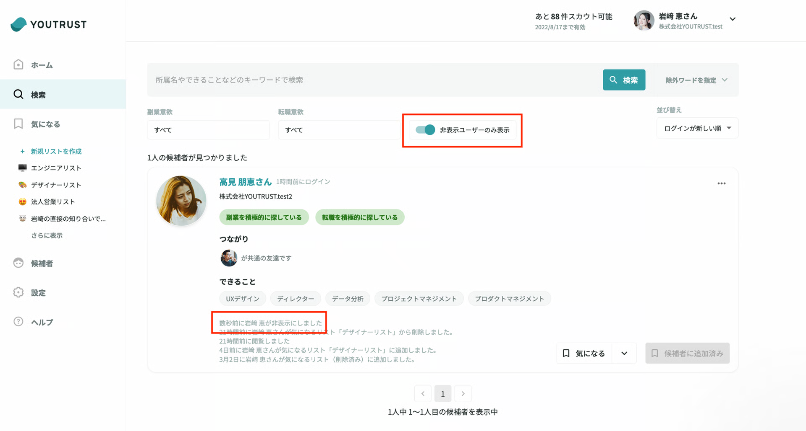

# :material-eye-off-outline: 検索画面から特定のユーザーを非表示にしたい

下記2つの箇所から、ユーザーを非表示にすることが可能です。

- リクルーター管理画面の検索結果一覧 > 各ユーザーカード右上の3点リーダ

- リクルーター管理画面の「検索」または「気になる」 > ユーザー詳細ページ > 右上の👁のマーク

一度非表示にしたユーザーは、検索画面上部の「非表示ユーザーのみ表示」にチェックを入れることで確認することができます。

また、非表示設定の範囲は、個人ではなく企業単位です。同じ会社の公式リクルーター全員に適応されます。

そのため、誰がいつ非表示に設定したかを確認したい場合は、ユーザーカード左下に、「○時間前に○○○○が非表示にしました。」と表示されますので、そちらからご確認ください。

非表示を外したい際は、非表示にした際と同様に、ユーザーカード右上の3点リーダから「非表示を解除する」を選択してください。
