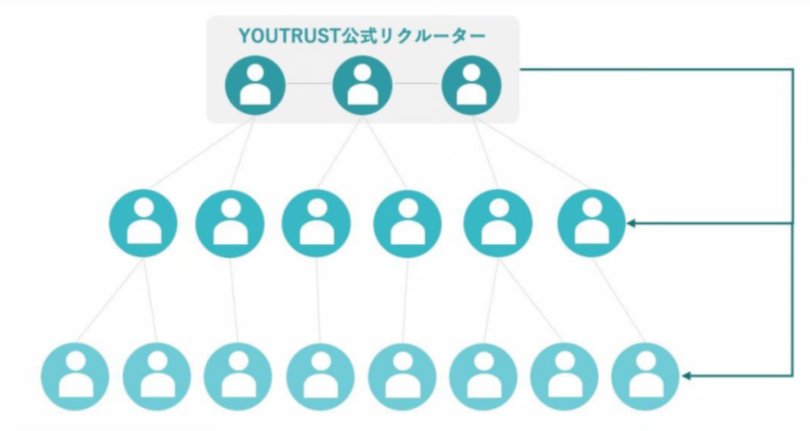

# :material-target: 候補者検索で出てくる範囲を知りたい

# リクルーター管理画面での検索

リクルーター管理画面内の候補者検索では、**「自分の友達の友達」**に加え**「同じ企業所属の他リクルーターの友達の友達」**までの範囲で表示されます。

# YOUTRUSTサービス画面での検索

YOUTRUSTサービス内検索でユーザーを探す際は、全ユーザーが検索対象ですが、名前・社名のみ検索が可能です。詳細なプロフィールは、友達でない限り閲覧できませんのでご注意下さい。

[:material-account-arrow-up: アプローチできる候補者を増やしたい](increase-approachable.md)

[:material-alert-outline: 検索画面に他のリクルーターのつながりが反映されない](connection-not-reflected.md)
