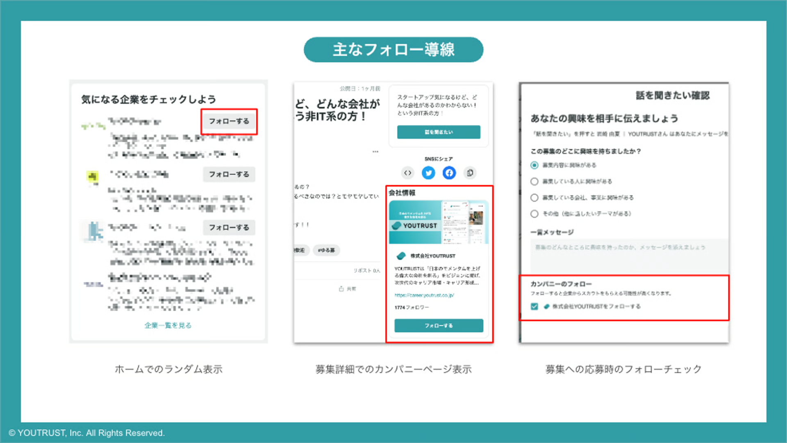
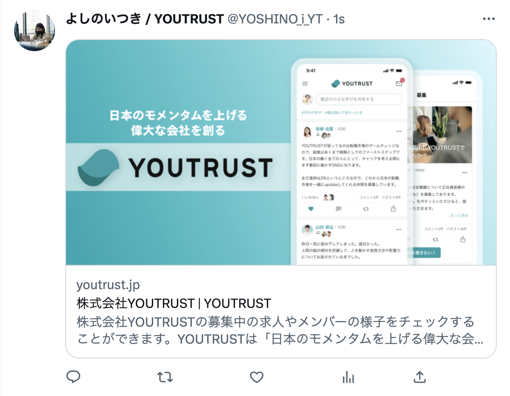

# :material-account-multiple-plus: 候補者を増やす

**YOUTRUSTで候補者を増やすには主に3つ方法があります。**

## **1. つながり候補とつながる**

[知り合いかも？](https://youtrust.jp/friend_candidates)からつながりましょう。

**「2次のつながり」の範囲**でスカウトができるというサービスの特性上、つながりが増えるほどアプローチできる候補者の数が増えます。

[知り合いかも？](https://youtrust.jp/friend_candidates)は、Facebookの友達やプロフィール情報の類似性を元に表示されます。

もっと知りたい方はこちらをご覧ください。

[友達・つながりについて知りたい](https://help.youtrust.jp/users/what-is-friends-connection)

[友達候補に出てくる人の条件を知りたい](https://help.youtrust.jp/recruiter/friend-candidate-condition)

## **2.リクルーター人数を増やす**

リクルーター権限を、契約プランでの上限人数までご利用いただくことをお勧めしています。

※ご契約のプラン毎にリクルーター権限をご利用できる人数に制限がございます。
契約書に記載のあるリクルーター人数についてご不明な点や、リクルーター人数を増やしたいなどのご要望がございましたら、担当のCXへご相談ください。

公式リクルーターについてはこちらをご覧ください。

[公式リクルーター権限を設定する](https://help.youtrust.jp/recruiter/setup_recruiter_account)

## 3**.カンパニーページのフォロワーを増やす**

### YOUTRUSTサービス内での導線を利用する

サービス内でのカンパニーページへのフォロー導線を随時強化しております。

PC web、アプリ共に募集からのカンパニーページフォローの流入が見込めます。

### 他SNSでカンパニーページURLを拡散する

カンパニーページのOGPは各企業のカバー画像が表示されます。

今後、SNSへの拡散がしやすいような開発も予定しておりますので、それまでは直接URLの拡散をおすすめいたします！

{ width="70%" style="display: block; margin: 0 auto;" }
