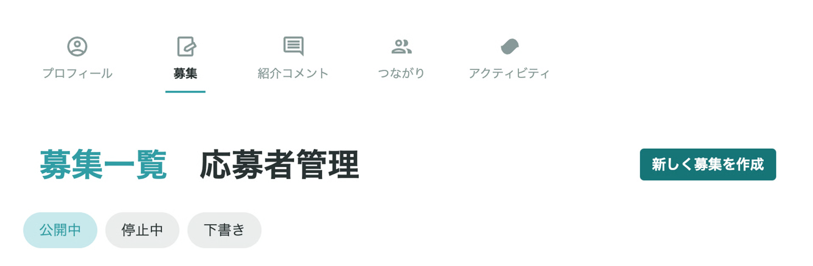
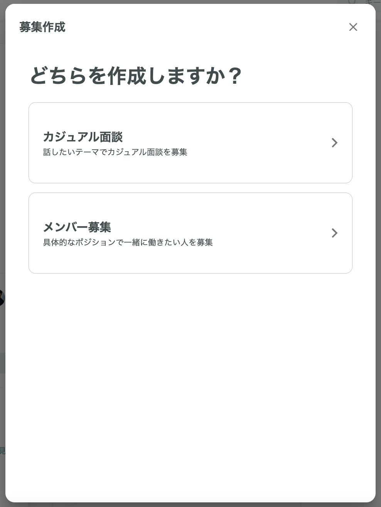
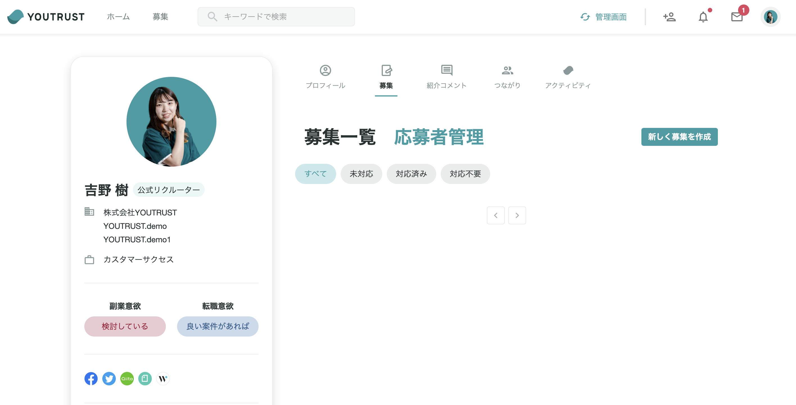

# :material-pencil-plus-outline: 投稿する

## :material-information-outline: 投稿とは

YOUTRUST上では無料で「通常投稿」「募集投稿」の2種類を掲載できます。

### :material-pencil-outline: 通常投稿

キャリアSNSとして、キャリアに関することや仕事での気づき等を自由に発信できます。

自社の雰囲気を効果的に伝えることができ、採用広報としても活用いただけます。

### :material-clipboard-text-outline: 募集投稿

「カジュアル面談募集」と「求人募集」の2つを募集できます。

**募集投稿では「話を聞きたい！」ボタンが生成される**ことが、通常投稿との大きな違いです。

## :material-star-outline: 投稿活用のメリット

通常投稿や募集投稿を活用することで、採用広報として自社に関する情報を発信できます。

求人募集やカジュアル面談募集は公式リクルーターからは無制限に投稿可能です。
また「全体公開」を選択いただければYOUTRUSTユーザー全体にも公開いただけます。

YOUTRUSTでは、企業アカウントではなく、個人ごとのアカウントからの投稿になります。
職種やポジション、経験業務などが異なる個人からの発信が可能になるため、より具体的に社内のイメージを発信できる点が特徴です。

▼投稿機能を活用して、採用できた事例

[募集投稿の活用で自社プロダクトがなくても導入2ヶ月で7人採用【きっかけはYOUTRUST】キュレーションズ 荒井宏之さん・平山里桜さん | YOUTRUST JOURNAL](https://lp.youtrust.jp/journal/posts/case-curations)

## :material-lightbulb-outline: 投稿のコツ

### :material-pencil-outline: 通常投稿のコツ

- **情報拡散チャネルとしての活用**
    - 社員インタビューの発信やプレスリリースの拡散など、自社に関する情報拡散チャネルの一つとしてご活用いただけます。
- **YOUTRUSTならではの情報発信**
    - noteやブログ記事よりもライトに投稿できる点もYOUTRUSTの特徴です。
    - 実際に活用されている企業では、「社内でのオンラインランチ会の様子」や「Slackでの普段のやりとり」など自社の雰囲気を伝えられる内容をカジュアルに発信いただいています。
- カンパニーページのメンバーに紐付いているユーザーからの投稿では、投稿時にカンパニーページに紐づけることを選択できます。

### :material-clipboard-text-outline: 募集投稿のコツ

- YOUTRUSTでは無料で、何度でも募集投稿を掲載することができます
募集投稿には「話を聞きたい！」ボタンが生成され、「話を聞きたい！」を押したユーザー宛には、友達の範囲外の方でも、チャットで連絡することが出来ます。
- 魅力的な募集投稿のポイント
    1. 自社の説明は簡潔に、イメージしやすい文章で伝える
    2. 募集要件は詳細化しすぎず、カジュアルに興味を持ちやすいもの
    3. 自社の魅力が伝わるURLやカバー画像を挿入し、自社の雰囲気が伝わる工夫を
    4. 副業か正社員の募集かを明記する
        - 副業からの正社員募集の場合は「おためし副業」「正社員を想定した副業スタート」などと記載するとイメージしやすくなります
- YOUTRUST投稿後に、XやFacebookで拡散すると、YOUTRUSTを登録していない方にもアプローチができます

    ▼投稿をX（旧Twitter）で拡散し、リーチを広げることで採用できた事例

    [初投稿から1週間。副業のスピード採用はなぜ成功したのか【きっかけはYOUTRUST 】TranSe CEO・安藤伊織さん | YOUTRUST JOURNAL](https://lp.youtrust.jp/journal/posts/case-transe)

## :material-file-document-edit-outline: 募集投稿の投稿方法・投稿への反応対応

### :material-upload-outline: 投稿方法

①YOUTRUSTマイページ「募集」から「新しく募集を作成」を選択してください。

②募集作成は「カジュアル面談」「メンバー募集」のどちらかを選択し、画面手順に従って設定を行ってください。

### :material-account-check-outline: 募集投稿への応募者管理

マイページ「募集」より応募者管理が可能でございます。

募集投稿に「話を聞きたい！」を押したユーザーには、つながりの範囲に関わらずメッセージにてご連絡いただけます。
※メッセージ送信可能者は募集を投稿したご本人のみになります。

### :material-monitor-dashboard: リクルーター管理画面での管理

**「話を聞きたい」を押したユーザーは、自動でリクルーター管理画面内の候補者リストに追加**されます。

[:material-clipboard-list-outline: 候補者を管理する](manage-candidates.md)

候補者リストには、ユーザーがどの募集投稿に反応したかが表示されます。

