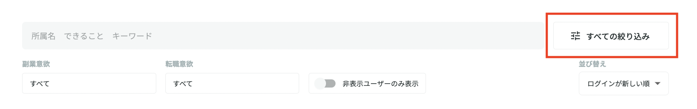
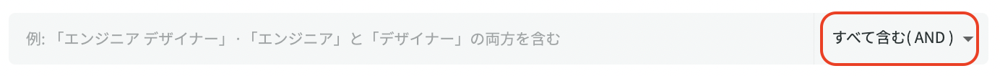
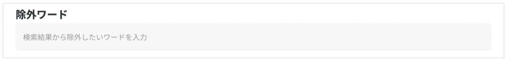
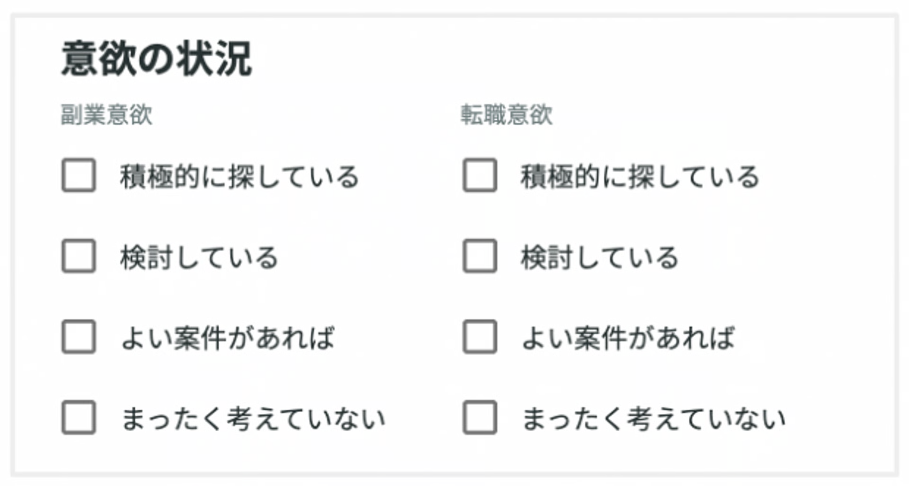
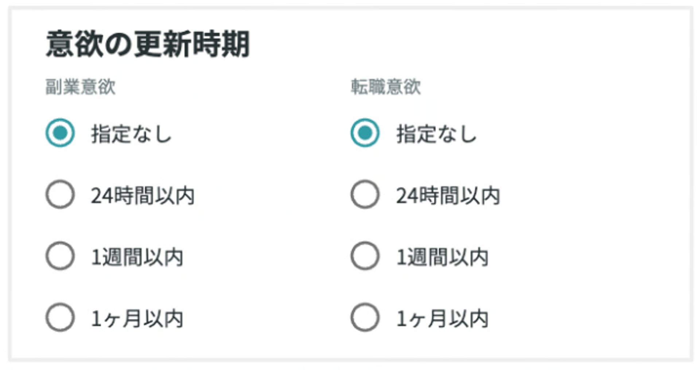
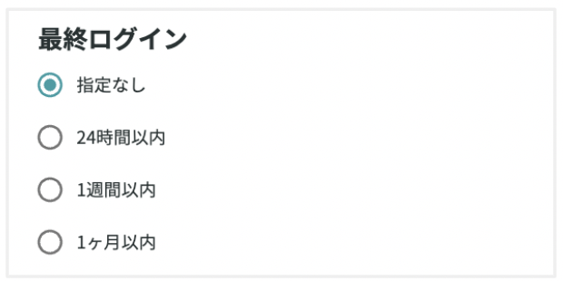
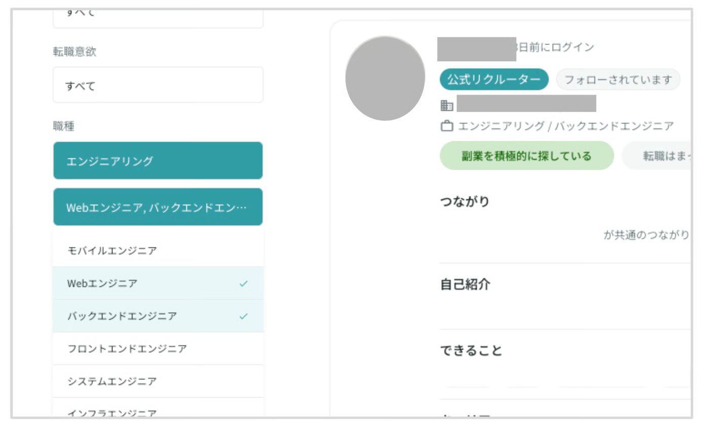
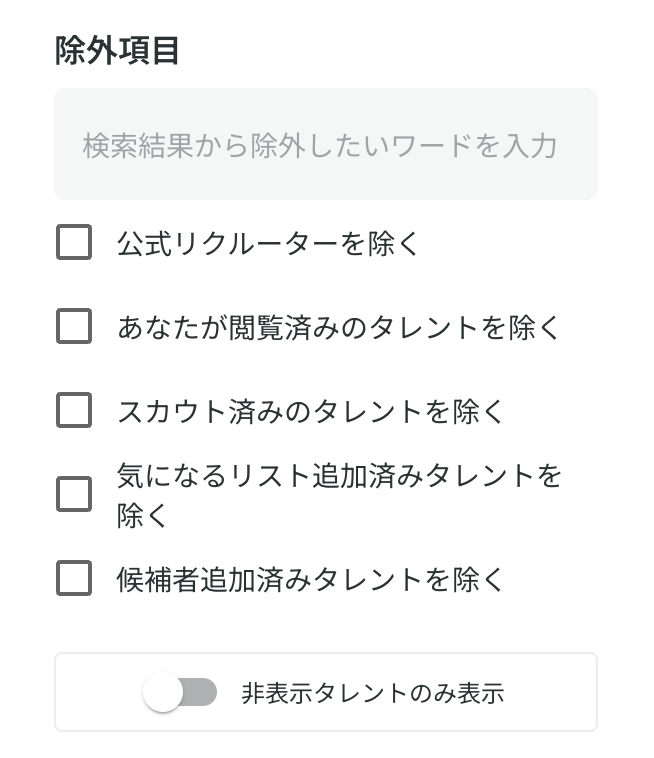
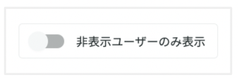
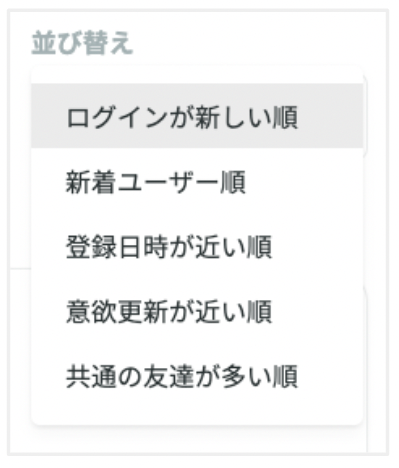

# 候補者を検索する

# リクルーター管理画面へのログイン

[YOUTRUST](https://youtrust.jp/)にログイン後、画面上部の「管理画面」より[リクルーター管理画面](https://youtrust.jp/recruiter_team)にログインできます。

リクルーター管理画面には現在ブラウザからのみ利用が可能です。

もしスマホから利用したい場合は、下記ヘルプページを参考にしてください。

<!-- TODO: リクルーター管理画面をスマホから使いたい への内部リンクを設定 -->

# 「検索」でできること

「すべての絞り込み」をクリックすることで、詳細な絞り込みを行うことが可能です。

### 1. フリーワードでの検索

- ユーザーがプロフィールに書いている内容をもとに、フリーワードでの検索が可能です。
- スペースを入力することで「and条件」「or条件」での検索もできます。
    - デフォルトは「and条件」となっており、検索窓の右「すべて含む（AND）」をクリックすると「いずれかを含む（OR）」が選択可能となります。
- 職種やスキル（エンジニアの場合は経験言語等）、出身企業名や業界など、採用したいターゲットに関する具体的なワードで検索してください。

### 2. 除外ワードの指定

- 1と同様に、除外したいワードも「and条件」で指定することが可能です。

### 3. 副業/転職意欲の絞り込み

- 転職意欲、副業意欲を「and条件」で絞り込むことが可能です。
- 正社員の採用をしたい場合は、転職意欲の上位3つを選択して検索することを推奨しております。

{ width="70%" style="display: block; margin: 0 auto;" }

### 4. 副業/転職意欲の更新時期の絞り込み

- 転職意欲、副業意欲を更新した時期を、24時間以内、1週間以内、1ヶ月以内で絞り込むことが可能です。

{ width="70%" style="display: block; margin: 0 auto;" }

### 5. 最終ログインの絞り込み

- 最終ログイン日時を、24時間以内、1週間以内、1ヶ月以内で絞り込むことが可能です。

{ width="70%" style="display: block; margin: 0 auto;" }

### 6. 職種の絞り込み

- ユーザーが職種を設定している場合、大項目・小項目で絞り込むことが可能です。
    - 大項目は単一選択、小項目は複数選択が可能です。

### 7. 除外項目の指定

- チェックを入れることで、下記3つを除外することが可能です。
    1. **公式リクルーター**
    2. **既に閲覧したタレント**　※ 個人単位
    3. **スカウト済みタレント**　※ 企業単位
    4. **気になるリスト追加済みタレント**　※ 企業単位
    5. **候補者追加済みタレント**　※ 企業単位

{ width="70%" style="display: block; margin: 0 auto;" }

### 8. 社内のリクルーターの友達の絞り込み

- チェックしたリクルーターの友達のみが表示されるようになります。
    - リファラル採用での活用を推奨しております。

{ width="70%" style="display: block; margin: 0 auto;" }

### 9. 非表示ユーザーの表示

- 非表示にしたユーザーを検索画面内で表示することが可能です。
- 非表示設定の範囲は、個人ではなく企業単位です。同じ会社の公式リクルーター全員に適応されます。
    - 詳細については、下記ヘルプページもご覧ください。

<!-- TODO: 検索画面から特定のユーザーを非表示にしたい への内部リンクを設定 -->

{ width="70%" style="display: block; margin: 0 auto;" }

### 10. 並び替え

- 検索結果は以下の5つの条件で並び替えが可能です。
    - ログインが新しい順
    - 新着ユーザー順
    - 登録日時が近い順
    - 意欲更新が近い順
    - 共通の友達が多い順

<!-- TODO: 「新着ユーザー順」とは何か知りたい への内部リンクを設定 -->

{ width="70%" style="display: block; margin: 0 auto;" }

# 候補者検索のコツ

YOUTRUSTはキャリアSNS（≠ 転職サイト）なので、**キャリアSNSならではの情報をキャッチできるかが「スカウト返信率」や「採用成功」に大きく影響**します。

下記ヘルプページにおいて、候補者探しにおけるコツとして、

1. 検索におけるコツ
2. 情報確認におけるコツ

の2つに分けて説明しておりますので、ぜひ参考にしていただけますと幸いです。

<!-- TODO: 候補者探しのコツを知りたい への内部リンクを設定 -->
