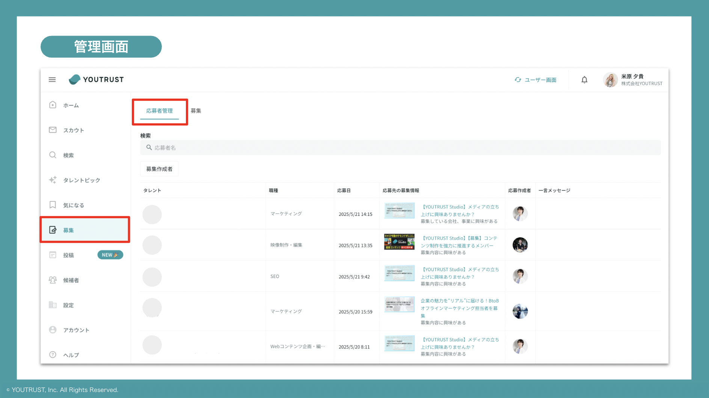
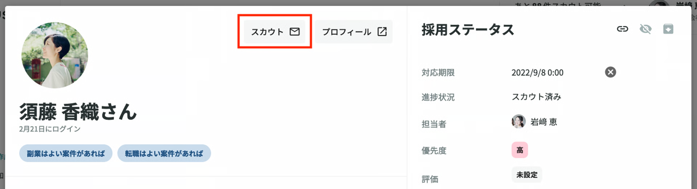

# :material-send: スカウトを送る

## :material-information-outline: スカウトとは

YOUTRUSTでは「友達の友達（2次つながり）」の範囲にスカウト（メッセージ）を送信できます。

YOUTRUSTのスカウトでは、テンプレート文章ではなく、個人の今までやってきたことやこれからやってみたいこと、志向性や興味関心に合わせてカスタマイズすることで、高い返信率が実現できています。

## :material-star-outline: スカウト活用のメリット

YOUTRUST登録ユーザーに、直接スカウトを送ることができます。

初めて連絡する方でも、共通の友人が必ず間にいる関係性なので、メッセージを受信するユーザー・送信するリクルーター双方にとっても、他媒体と比較すると
より安心してやりとりできます。

転職・副業意欲のある方へのスカウトだけでなく、長期的に関係構築・アプローチしたい方へのファーストコンタクトや、アドバイザーとして相談したい方へのご連絡など、幅広く活用いただけます。
※自社以外の紹介・あっせんを目的としたスカウト送信・サービス利用は禁止しております。
詳しくはこちらの[利用規約](https://youtrust.jp/terms_of_service)をご確認ください。

## :material-format-list-numbered: スカウト送信の手順

### 1. リクルーター管理画面にログイン

[YOUTRUST](https://youtrust.jp/)にログイン後、画面上部の「管理画面」より[リクルーター管理画面](https://youtrust.jp/recruiter_team)にログインできます。

### 2. スカウト送信対象を検索する

候補者検索時の操作方法、検索のコツは[:material-account-search: 候補者を検索する](search-candidates.md)をご覧ください。

### 3. スカウトルームを立ち上げる

ユーザーのプロフィール画面、もしくはリクルーター管理画面のスカウトボタンからスカウトルームを立ち上げることができます。

※メッセージとスカウトの違いは[スカウトとメッセージの違いを知りたい](../faq/scout/scout-vs-message.md)をご覧ください。

サービス画面からのスカウト送付ボタン

管理画面からのスカウト送付ボタン

## :material-lightbulb-outline: スカウトのコツ

YOUTRUSTのスカウト返信率が他媒体と比較して高いのは、個人に合わせてカスタマイズされているためです。
返信率の高いスカウトに共通するポイントを簡単にご案内します。

### 1. 必ずはじめにWhy you

- YOUTRUSTのユーザーは他媒体でも多くのスカウトを受け取った経験をしているケースが多く、「自分に向けられた文章である」「なぜ自分なのか」がわかる文章にすることで
他社との差別化をすることが重要です。
- 経歴×発言、スキル×考え方、経験×カルチャーなど、
相手の惹かれた部分を2つ以上は盛り込んでみましょう。

### 2. 共通点を活用

- YOUTRUSTはキャリアSNSです。
今までの経歴だけでなく、趣味や友達とのつながりがわかることが特徴です。
- 「共通の知人」や「共通の趣味」に触れると安心感が生まれ、返信率も高くなります。

### 3. カジュアルなお誘い

- 実際に採用がうまくいっている企業は、スカウトの時点では「まずは会ってお話ししたい」ことを伝えています。
- 会った時に「正社員になって欲しい」など期待値を調整し、その後アトラクトする、といったように段階を踏んだやりとりをすることがポイントです。

### 4. 300〜400文字程度の文章

- YOUTRUSTはチャットUIなので、長い文章は読みづらくなってしまします。
- ベストは350文字程度、長くても700文字を超える文章は控えましょう。

**もっと詳しく知りたい方は[こちら](https://docs.google.com/presentation/d/1K-AGfyGqjraeiNuboH7p0jnddRTTPy_988PbEM1UYOE/edit?slide=id.g2e32ef78b24_0_86#slide=id.g2e32ef78b24_0_86)を参照ください。**
