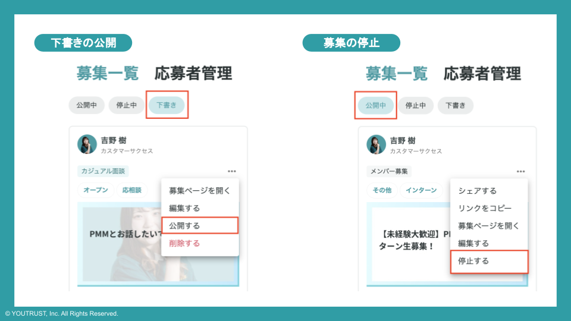
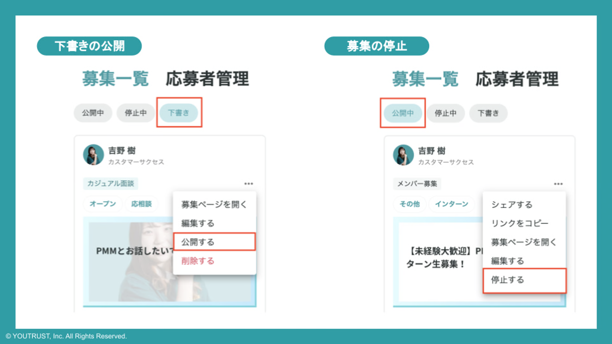

# 募集のステータス管理をする

## 募集の管理

- マイページ「募集一覧」から作成した募集のステータス管理が可能です。
- 無料で募集1つまで公開できます。

（複数募集を同時に公開したい場合は、有料でのご契約が必要でございます。）

※「停止中」ステータスの募集は募集一覧では「この募集は終了しました」と表示され、新規の「話を聞きたい」ができなくなります。

### 下書き中の募集を公開したいとき

- マイページ「募集一覧」を確認
    - 「下書き」ステータスのものを「公開」に変更

### 募集を停止したいとき

- マイページ「募集一覧」を確認
    - 「公開中」ステータスから該当募集を「停止する」に変更

## 応募者管理

- マイページ「応募者管理」に「話を聞きたい」したユーザーが表示されます。
- 「応募者管理」で「未対応」「連絡済み」「対応不要」でステータス管理が可能です。
    - すべての応募者に対して連絡することが必須ではございませんので、未対応の方がいないようご確認ください。（連絡済みか対応不要で管理してください）
- 「応募者管理」から各応募者に対してメッセージを開始できます。

