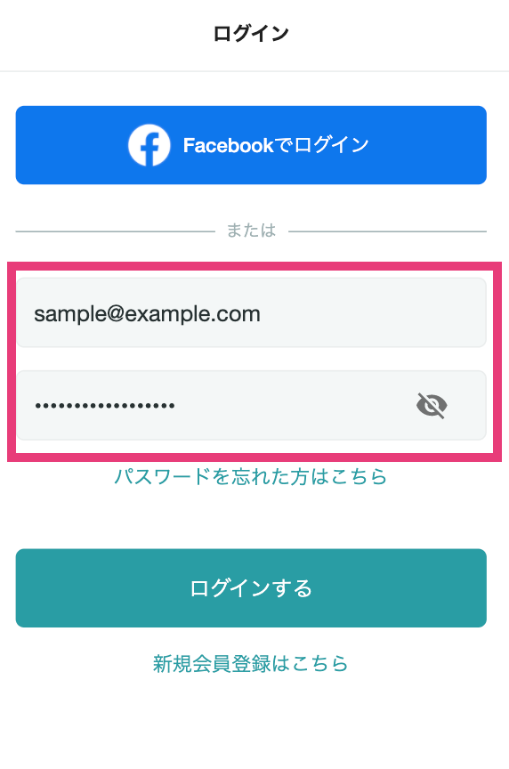

# :material-key: Facebook登録後にログインパスワードを別途設定したい

Facebookを使って登録・YOUTRUSTアカウント作成した場合でも、設定画面からメールアドレスの認証とパスワードの設定をすることで、メールアドレスとパスワードを用いた形式でもログインできるようになりました。

また、Facebookでのログインも従来通り行うことができます。

## :material-cellphone: アプリ

ホーム>アイコン>メニューバー>設定>外部連携>パスワードの設定 から設定できます。

## :material-monitor: Web

こちらの[設定画面](https://youtrust.jp/settings)の『パスワード設定』よりパスワードを設定できます。

パスワードの設定をクリックした際に、メールアドレスの認証が済んでいない場合にはメールアドレスの認証が必要になります。表示された内容に従って進んでください。

{ width="50%" style="display: block; margin: 0 auto;" }

{ width="50%" style="display: block; margin: 0 auto;" }

{ width="50%" style="display: block; margin: 0 auto;" }

パスワード設定後、メールアドレスとパスワードを入力することでログインもできるようになります。
