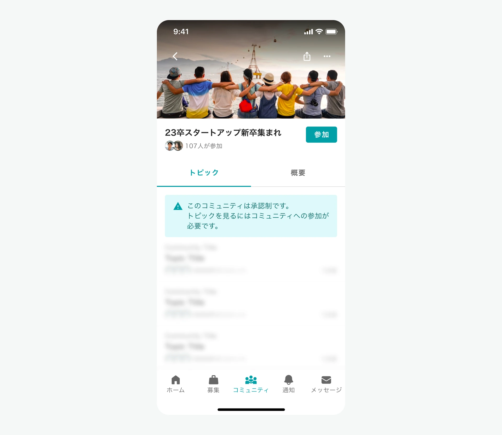

# :material-account-arrow-right: コミュニティの参加方法を知りたい

YOUTRUSTのコミュニティには「全体公開」「承認制」の2種類があり、それぞれで参加方法・特徴が異なります。どちらのコミュニティもコミュニティに参加することで、コミュニケーションを取ることができるようになります。

## :material-earth: 全体公開

誰でも参加できるコミュニティです。

コミュニティ参加前から、どんなトピックがあるかを見ることができます。

## :material-lock-outline: 承認制

コミュニティオーナーに参加申請を送り、承認されることで入ることができるコミュニティです。

参加メンバーのみがコミュニティ内のトピックを見ることができます。

コミュニティ名や説明文を見て、自分の興味・関心や、職種・業界・年代など、つながりを感じられるコミュニティにご参加ください。

## :material-link-variant: 関連ページ

- [コミュニティ ルールブック](rulebook.md)
- [YOUTRUSTコミュニティについて知りたい](about.md)
- [コミュニティの退出方法を知りたい](leave.md)
- [コミュニティへの投稿方法を知りたい](post.md)
- [コミュニティの作成方法を知りたい](create.md)
- [コミュニティオーナーが出来ることを知りたい](owner-guide.md)
