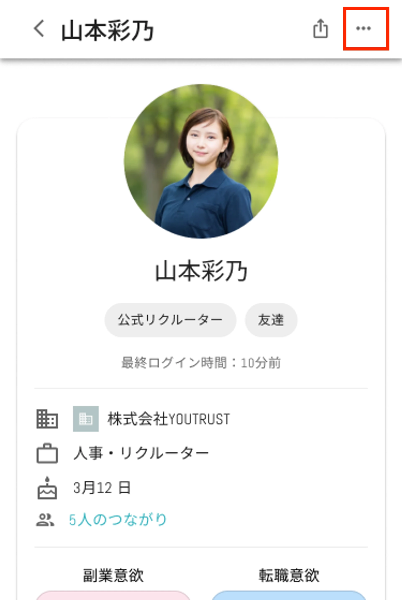
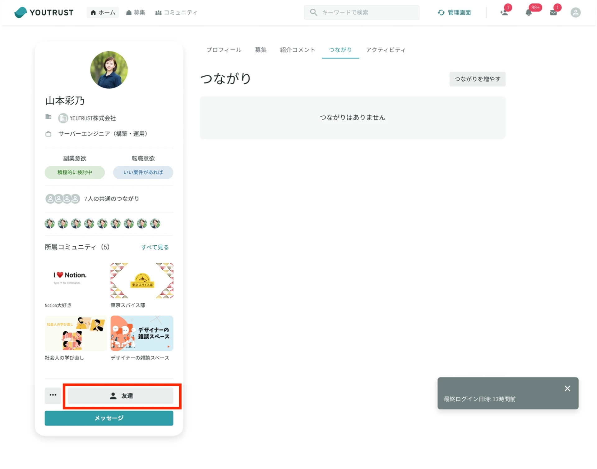

# :material-link-variant-off: つながりを解除したい

YOUTRUSTでのつながりをブロックまたは解除したい対象の人の[プロフィールページ](https://youtrust.jp/mypage?tab=friends)を開き、

- **アプリ**：右上の三点マークから「つながりから外す」「ブロックする」を選択
- **Web**：プロフィール画像下の「つながり」というボタンをクリックすると「つながりから外す」「ブロックする」を選択

「つながりを外す」を選択した場合は、一度つながってもつながりを解除することができます。

## 友達から外す

友達ではなくなり、その人のつながりの投稿は閲覧できなくなります。しかし、自分のプロフィールを相手は閲覧・検索出来る状態のままになります。

※相手には通知されません

対象の人の[プロフィールページ](https://youtrust.jp/mypage?tab=friends)を開き、

- **アプリ**：右上の三点マーク
- **Web（友達）**：左下の「友達」のボタン
- **Web（友達以外）**：左下の三点マーク

をクリックすると、「友達から外す」の項目が現れます。

{ width="50%" style="display: block; margin: 0 auto;" }

## ブロックする

友達かに関わらず、自分のプロフィールを対象者が閲覧・検索できないようにします。
**ブロックした相手からはメッセージも受信できず、またあなたの投稿も閲覧されないようになっています。**
ブロックした相手による他のユーザーへのコメントは、タイムラインに表示されません（コメント元の投稿は閲覧できます）。
友達だった相手は、**ブロック後友達からも外されます。**

※ブロックは、相手には通知されません。

※ブロックをする際に相手のプロフィールに訪れた際、ブロックされるまでの間は一時的に足跡がついた状態になりますが、ブロックすることで足跡通知は消える仕様となっております。そのため、安心してブロック対応を行っていただけます。

[「ブロックする」について知りたい](block.md)

また利用規約に違反するユーザーを発見した場合には、運営に報告することができます。

[違反ユーザーを運営に報告したい](report-violation.md)
