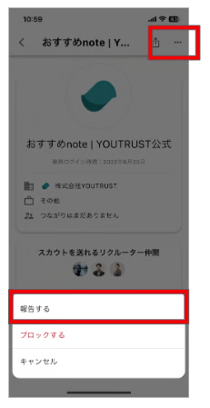
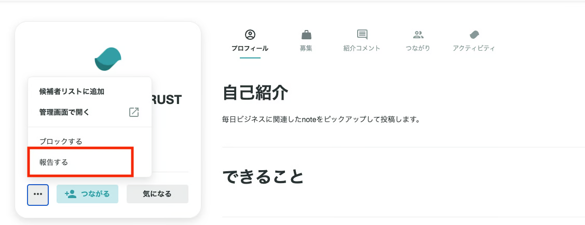

# :material-alert-outline: 違反ユーザーを運営に報告したい

[利用規約](https://youtrust.jp/terms_of_service)に反するユーザーを見つけた場合、以下の方法で運営に報告することができます。

違反ユーザーの[プロフィールページ](https://youtrust.jp/mypage?tab=friends)を開き、

- **アプリ**：右上の三点マーク
- **Web**：背景画像の三点マーク

をクリックし、「報告する」から送信できます。

{ width="300" style="display: block; margin: 0 auto;" }

{ width="500" style="display: block; margin: 0 auto;" }

ブロックと報告の違いは、下記ページを参考にしてください。

[:material-block-helper: 「ブロックする」について知りたい](block.md)

[:material-flag-outline: 「報告する」について知りたい](report.md)
