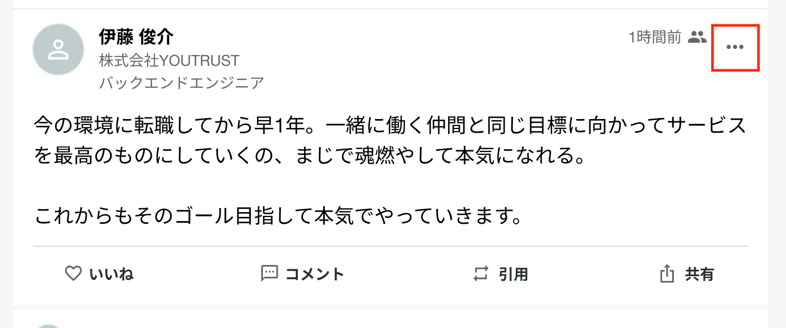

# :material-flag-outline: 「報告する」について知りたい

[利用規約に違反しているユーザー](../post/deletion-policy.md)を見つけたり不快な思いをされたりした場合は、「報告する」を押すと、運営に報告することができます。

また、「報告する」機能は、アカウントだけでなく、投稿やコメント・チャットルームに対しても行うことができます。

## 「報告する」とどうなる？

- 報告したことは相手には通知されません。
- 報告を受けると、YOUTRUSTの運営チームにて内容を確認します。
    - 利用規約や法令に違反している内容があった場合には、当該ユーザーへの警告や該当内容の削除・アカウント削除といった対応をします。
- ブロックとは違い、**閲覧や検索等に制限はかかりません。**

## アカウントの報告手順

報告したい対象の人の[プロフィールページ](https://youtrust.jp/mypage?tab=friends)を開き、

- **アプリ**：右上の三点マーク
- **Web（友達）**：「友達」のボタン
- **Web（友達以外）**：左下の三点マーク

をクリックすると、「報告する」の項目が現れます。

{ width="50%" style="display: block; margin: 0 auto;" }

## 投稿の報告手順

アプリ、Webともに、右上の三点マークをクリックすると、「報告する」の項目が現れます。

また、アカウントは報告だけでなく、ブロックすることも可能です。

[「ブロックする」について知りたい](block.md)
