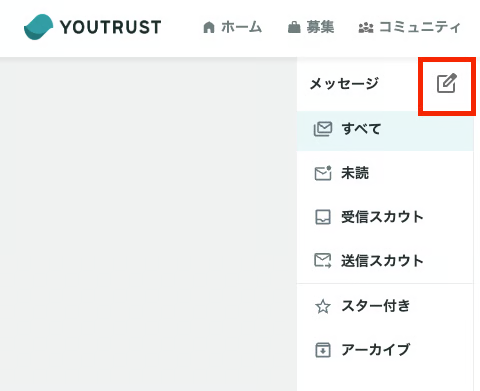

# :material-chat-plus-outline: グループチャットを作りたい

YOUTRUSTではグループチャットの作成が可能です。

## グループチャット作成方法

1. YOUTRUSTメッセージ画面を立ち上げる
2. 左タブの新規作成ボタンを押す
    
3. 追加したいユーザーを選択する
   ※候補として表示されるのは、直接つながっているユーザーのみです。
4. グループ作成後、メッセージを送信する

!!! info "グループ作成時の注意"
    メッセージを送信したタイミングで、招待相手にもグループチャットが作成された通知が届きます。グループを作成しただけでは通知されないため、必ず最初のメッセージを送信してください。

## グループチャットの名称を変更したい

グループチャットの名称を変更することが可能です。

チャット欄上部の✎マークで編集いただけます。
