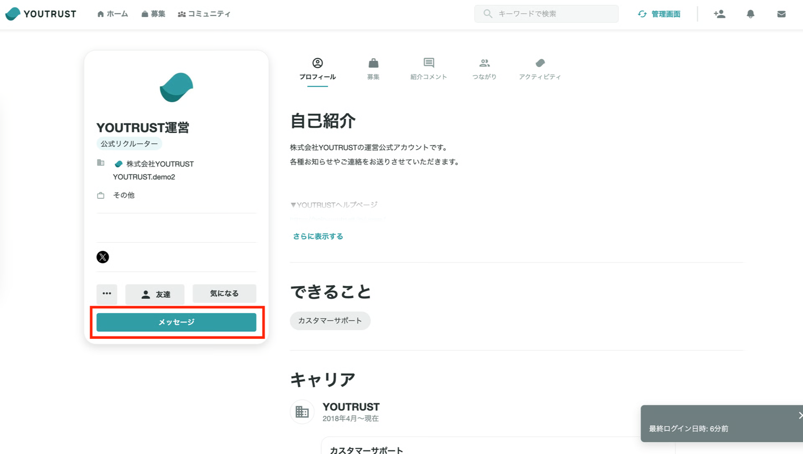

# :material-reply: メッセージに返信したい/送りたい

YOUTRUSTでつながっている企業や友達とはメッセージでやりとりしましょう！

右下のメッセージ（✉️アイコン）をタップすることで、チャットボックスが開きます。未読のメッセージがある時は、赤い通知マークが表示されます。

## :material-reply: メッセージに返信したい

メッセージボックスから返信したいスレッドを選択すると、内容が確認できます。通常テキストのほか添付マークから画像やファイルを送ることも可能です。

なお、メッセージが**未読の場合**のみ、一度送ったメッセージの送信を取り消すことができます。

- アプリの場合：取り消したいメッセージの長押し＞「送信を取り消す」を選択
- WEBの場合：取り消したいメッセージの3点リーダーをクリック＞「送信を取り消す」をクリック

## :material-send: メッセージを送りたい

メッセージを送れる相手は以下の通りです。

- 直接の友達
- 求人投稿に「話を聞きたい」ボタンを押して下さった方
- 公式リクルーター

メッセージを送りたい人のマイページ→「メッセージ」からを送ることができます。

※対象外の場合は、ボタンが表示されません

利用規約を守ってぜひ気持ち良いコミュニケーションを進めてください！

## :material-cog-outline: メッセージ受信時のメール配信設定/プッシュ通知設定を変更したい

メッセージを受信した時にメール配信・アプリのプッシュ通知するかのON/OFFを設定で変更できます。詳細はこちらのページをご覧ください。

- [:material-email-outline: メールの配信設定を確認・変更したい](../notification/email-settings.md)
- [:material-cellphone-message: アプリのプッシュ通知設定を変更したい](../notification/push-settings.md)
