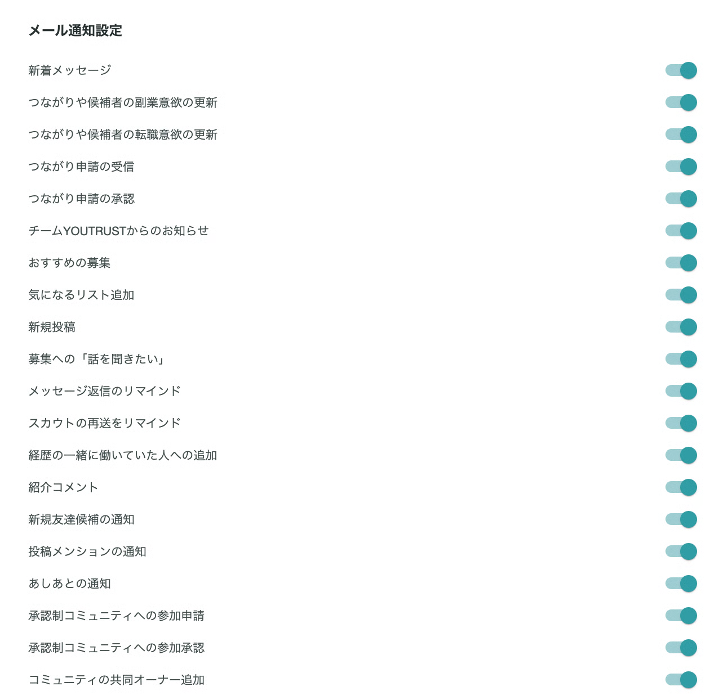

# :material-email-outline: メールの配信設定を確認・変更したい

## アプリ

ホーム＞アイコン＞メニューバー＞設定＞通知設定＞「メール」タブにて、配信メールの設定を確認・変更できます。

アプリのプッシュ通知設定を変更したい場合には、同ページの「プッシュ通知」タブで設定してください。

## Web

こちらの[設定画面](https://youtrust.jp/settings/notification)から、配信メールの設定を確認・変更できます。

## メール

メールフッターの「メールの配信停止はこちら」のリンクにアクセスするとメール通知設定をOFFにすることができます。

{ width="50%" style="display: block; margin: 0 auto;" }

こちらの対応をしてもメール配信が停止されない場合には、[お問い合わせ窓口](../other/contact.md)からお問合せください。
