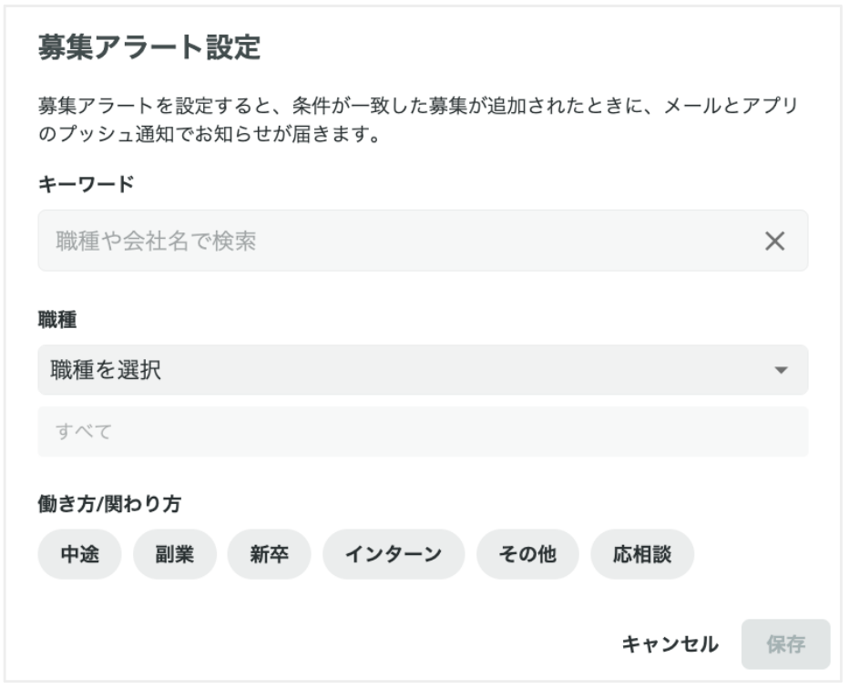
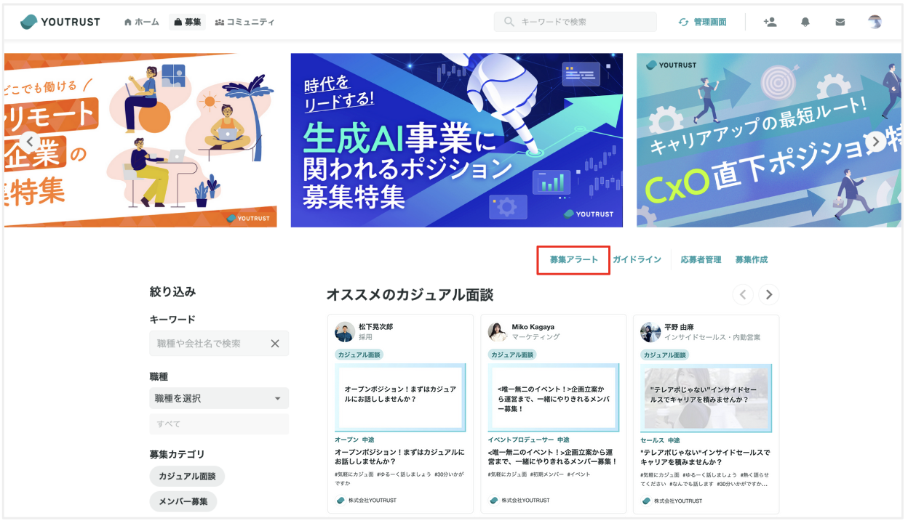

# :material-bell-ring-outline: 募集アラートについて知りたい

## :material-help-circle-outline: 募集アラートとは？

募集アラートとは、希望する条件に合致する募集が新規公開された際に通知を受け取ることができる機能です。

希望の「キーワード」「職種」「働き方/関わり方」に合致する募集が新規公開されると、メールやプッシュ通知でお知らせが届きます。

この機能を利用すると、自分の興味がある募集が公開された際に、いちはやく情報を受け取ることができます。ぜひお試しください！

[副業・転職など募集情報を探したい](../message/search-jobs.md)

### :material-monitor: Web

{ width="350" }

### :material-cellphone: アプリ

{ width="200" }

## :material-cog-outline: 設定方法

1. [募集ページ](https://youtrust.jp/recruitment_posts) に進みます。
2. Webブラウザの場合は、画面中央の「募集アラート」をクリックします。アプリの場合は、画面右上の🔔マークをタップします。
3. 希望の「キーワード」「職種」「働き方/関わり方」を入力し、「保存」で完了です。

{ width="600" style="display: block; margin: 0 auto;" }

## :material-alert-circle-outline: 注意点

- 募集アラートは、1人当たり1件まで設定可能です。2件以上の設定はできません。
- 通知を受け取るには、設定において通知をオンにしておく必要があります。

[メールの配信設定を確認・変更したい](email-settings.md)

[アプリのプッシュ通知設定を変更したい](push-settings.md)
