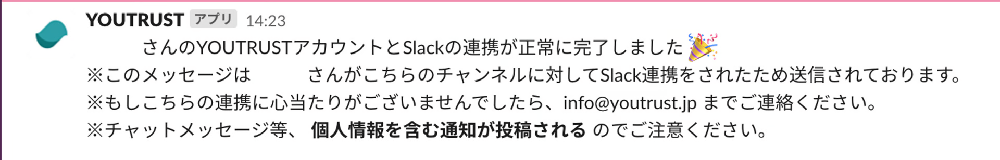

# :material-slack: Slack連携を設定したい

マイページの[設定](https://youtrust.jp/settings)＞Slack連携より設定できます。

YOUTRUSTから送信される各種通知をSlackで受け取るためには、SlackのIncoming Webhookというアプリが発行するWebhook URLと呼ばれる文字列をYOUTRUSTにて登録する必要があります。

以下の手順に従って連携を行ってください。

## 連携手順

1. Slackアプリのサイドバーから「その他」＞**「App」を選択**してください。
    

2. **「Appディレクトリ」**を選択してください。（ブラウザでSlackのページが開かれます）
    

3. Slackのページにある検索フォームに「incoming webhook」と入力して検索を実行してください。

4. 検索結果に表示された**「Incoming Webhook」を選択**してください。
    

5. **「Slackに追加」**をクリックしてください。
    

6. 通知連携先のチャンネルを選択or新しいチャンネルを作成し、**「Imcoming Webhookインテグレーションの追加」**ボタンをクリックしてください。
    

    !!! warning "注意"
        Slack連携するとチャットメッセージの本文等のプライベートな情報がここで指定するチャンネルに通知として投稿されます。（YOUTRUST側でチャンネル指定を上書きすることも可能です）

        ご自身へのダイレクトメッセージとして受け取るか、新たにプライベートなチャンネルを作成して指定するなどして、通知を受け取るユーザーを制限するようにしてください。

7. 作成が完了したら、**生成されたWebhook URLをコピー**してください。
    

8. [YOUTRUST](https://youtrust.jp/)の「[設定](https://youtrust.jp/settings)」を開いてください。

9. 7でコピーしたWebhook URLをペーストして、**認証ボタン**をクリックしてください。
    

10. お使いのSlackへ確認メッセージが投稿されれば連携完了となります。
    
