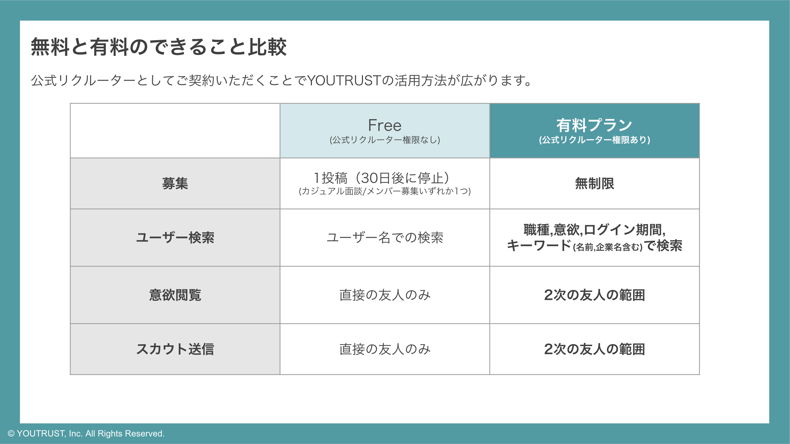

# :material-account-tie: 公式リクルーター(採用アカウント)とは何ですか？

公式リクルーター(採用アカウント)とは、YOUTRUSTにご登録しているユーザー様に向けて有料プランをご契約の上、自社の採用活動を行っている企業の担当者を指しています。

公式リクルーターになることで、YOUTRUSTの特徴を最大限活用し自社の採用活動を効率良く効果的に行うことができます。

## :material-compare: 無料会員と公式リクルーターの比較

{ width="600" style="display: block; margin: 0 auto;" }

## :material-help-circle-outline: お問い合わせ

公式リクルーターの詳細が聞きたい・興味がある・契約したいといったお問い合わせは、以下のページからご連絡くださいませ。担当者より折り返しご連絡させていただきます。

[＜企業様向け＞ YOUTRUST | 副業・転職のキャリアSNS](https://youtrust.jp/lp_recruiter)

## 関連ページ

- [お問い合わせ窓口](contact.md)
