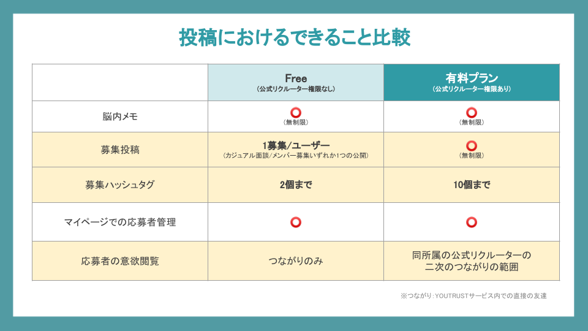

# :material-currency-jpy: 投稿に費用がかかるのか知りたい

YOUTRUSTの募集は、**無料で1つまで公開**することができます。  
脳内メモは全ユーザーが無制限に投稿することが可能です。

{ width="700" style="display: block; margin: 0 auto;" }

有料でご契約いただきますと、募集も無制限に公開可能となりますので、ぜひお問合せください！

正社員、契約社員、アルバイトなど雇用契約を結ぶ募集を出す際には、こちらの注意事項（[雇用契約を伴う求人掲載時の注意点](job-posting-notice.md)）をよく読んで投稿するようにしてください。

また利用規約に反する投稿をした場合には、事前の通告なく削除される場合があります。（[削除対象となる投稿](deletion-policy.md)）

[利用規約](https://youtrust.jp/terms_of_service)をよく読みルールを守って、YOUTRUSTをご活用ください。
