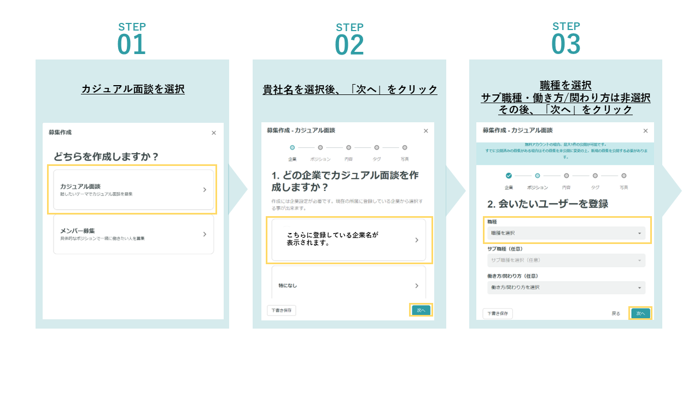

# :material-star-outline: 募集特集企画への参加の仕方

## :material-information-outline: 概要

- 募集期間中に、参加したい特集企画のハッシュタグを選択してカジュアル面談を投稿頂きますと、特集企画にピックアップさせて頂きます。
- 投稿する内容は、特集企画に沿ったものにして頂けますと、よりピックアップされやすくなります。

## :material-format-list-numbered: 特集企画用カジュアル面談の作成方法

1. PCWebからカジュアル面談の募集を作成
2. 特集企画のハッシュタグを選択
3. 特集企画に沿った内容で投稿

{ width="900" style="display: block; margin: 0 auto;" }

{ width="900" style="display: block; margin: 0 auto;" }

{ width="900" style="display: block; margin: 0 auto;" }

## :material-alert-circle-outline: 注意事項

- カジュアル面談の募集投稿作成はPC版YOUTRUSTからのみとなります。
- 特集にピックアップする投稿は、YOUTRUST運営にて選定させていただきます。
- 選定に関して、お問い合わせは受け付けておりません。

## :material-coffee-outline: カジュアル面談とは

カジュアル面談を募集することで、趣味嗜好や働き方の温度感が合う人と、1タップで接点を持つことができるようになり、これまで以上に気軽にキャリア形成のための"つながり"を作れるようになります。制作におけるガイドラインはこちらからご確認くださいませ。

[カジュアル面談Guideline](casual-meeting-guideline.md)
