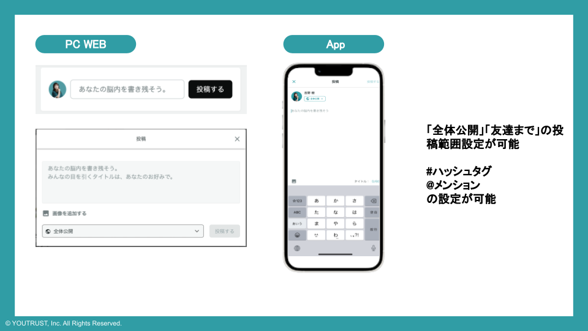
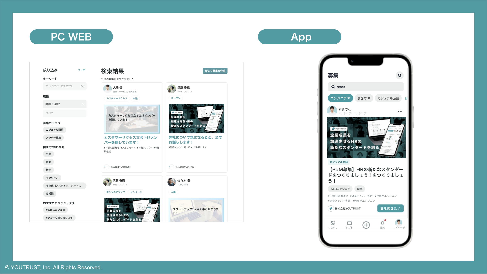

# 投稿タイプのちがいを知りたい

YOUTRUSTの投稿には2種類の投稿タイプがあります。
うまく使い分けてたくさんの人に投稿を見てもらいましょう。

!!! tip "投稿タイプの使い分け"
    **カジュアル面談、メンバー募集は「募集」から投稿してください！  
    脳内メモは「ホーム」から投稿してください！**

---

## 通常投稿

「投稿する」からは、どんなトピックでも自由に投稿できます。  
ハッシュタグや画像を使えば、タイムラインで目に留まりやすくなります。

{ width="700" style="display: block; margin: 0 auto;" }

---

## 募集投稿

「募集」は2つのカテゴリで募集ができます！

募集投稿は、PCWebからホーム右「募集」もしくはマイページ「募集」タブにて「新しく募集を作成」をクリックで投稿することができます。  
※アプリ、SPWeb：2025年2月時点では募集投稿の作成はできません。

{ width="700" style="display: block; margin: 0 auto;" }

!!! info "カジュアル面談"
    話したいテーマでカジュアル面談を募集できます。

!!! info "メンバー募集"
    具体的なポジションで一緒に働きたい人を募集できます。

募集投稿にすることで、「募集」一覧に表示されるようになります。

{ width="700" style="display: block; margin: 0 auto;" }
