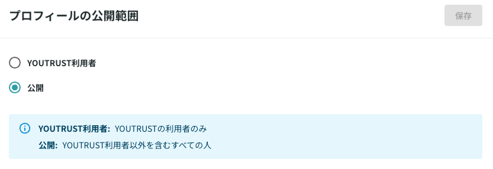

# プロフィールの公開範囲を知りたい

プロフィールはYOUTRUSTユーザー以外でも閲覧できる仕様となっております。

YOUTRUSTユーザー以外の方へのプロフィールの公開を制限したい場合は、下記手順によって設定が可能です。

## :material-cellphone: アプリ

プロフィール ＞ 右上の⚙️マーク ＞ プロフィールの公開範囲より、プロフィールの公開範囲を設定できます。

## :material-monitor: Web

{ width="600" style="display: block; margin: 0 auto;" }

[プロフィールの公開範囲設定画面](https://youtrust.jp/settings/profile_public_range)からプロフィールの公開範囲を制限するこができます。
