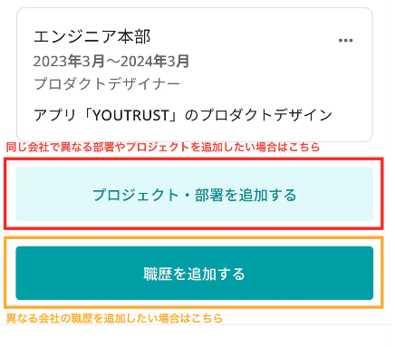
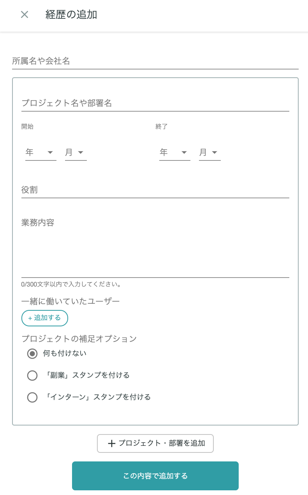

# :material-briefcase-outline: 経歴を入力したい

!!! tip "ヒント"
    同じ企業で複数のプロジェクトや部署に関わっていた場合には、下部の「プロジェクト・部署を追加」から追加することができます

!!! tip "ヒント"
    異なる所属・企業での経歴を登録する場合には、新たに「＋経歴の追加」ボタンから登録してください。開始月が新しいものが上に表示されるように自動で並び替えられます。

## :material-cellphone: アプリ

ホーム＞自分のアイコンをタップ＞ 「プロジェクト・部署を追加する」

{ width="400" style="display: block; margin: 0 auto;" }

## :material-monitor: Web

[マイページ](https://youtrust.jp/mypage?tab=profile)の「経歴」欄から追加・編集ができます。

- 「+経歴の追加」をタップ
- 以下の項目が必須事項です
    - 所属名や会社名（例：株式会社YOUTRUST）
    - プロジェクト名や部署名（例：マーケティング）
- 以下の項目は任意記入ですが、記入されていた方が企業の目に留まりやすくなります
    - 開始・終了期間
    - 役割（例：プロジェクトリーダー）
    - 業務内容
    - 一緒に働いていたユーザー（YOUTRUSTの友達が候補で表示されます）
- プロジェクトの補足オプション
    - 「副業」または「インターン」で関わっていた場合には、スタンプをつけることが可能です

{ width="500" style="display: block; margin: 0 auto;" }
