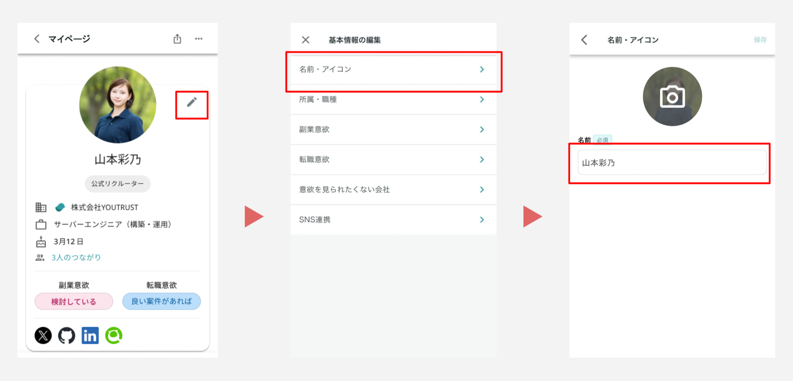

# 表示プロフィール名を変更したい

## :material-cellphone: アプリ

ホーム＞自分のアイコンをタップ＞ 右上の✐マーク＞「名前・アイコン」から編集が可能です。

{ width="800" }

## :material-monitor: Web

[マイページ](https://youtrust.jp/mypage?tab=profile)の所属コミュニティ下の「編集する」から可能です。

{ width="800" }

フルネームに加え、ビジネスネーム/ハンドルネームなども入力いただくと、発見されたり認識されやすくなります。

YOUTRUSTには、お名前にビジネスネームを追記される方も多くいらっしゃいますので、ぜひご活用ください。
