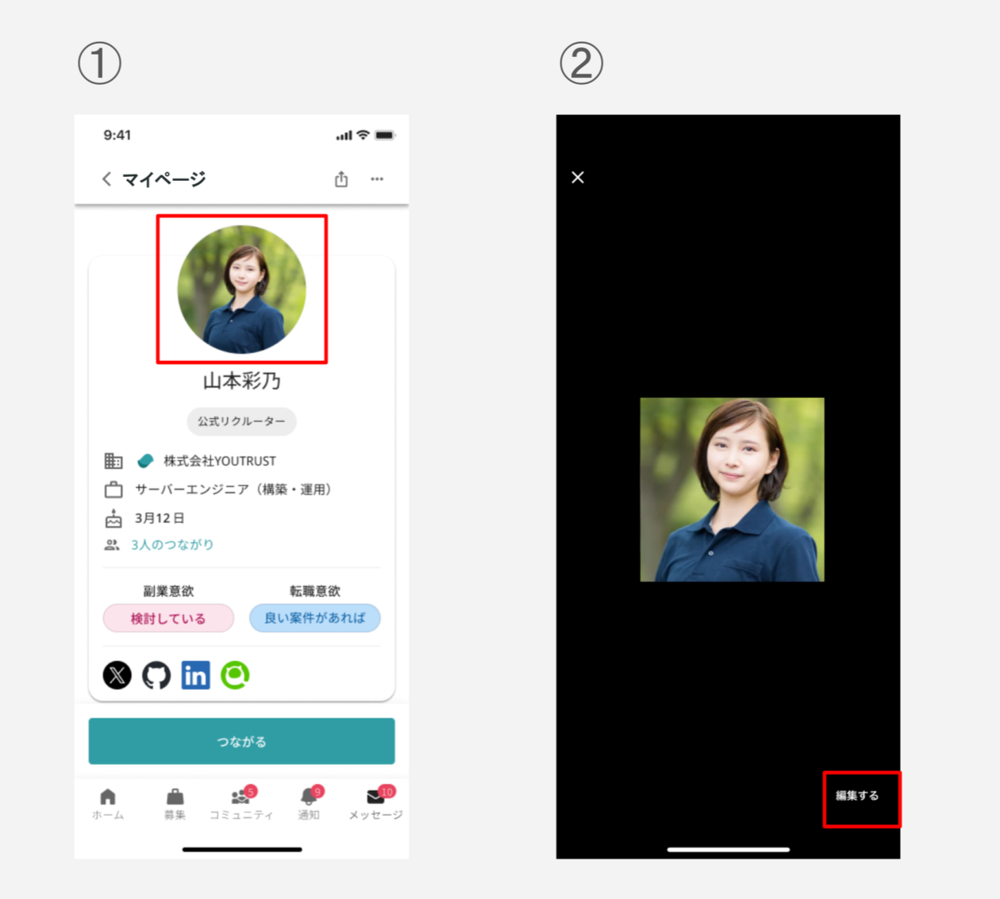

# :material-camera-account: プロフィール写真を変更したい

## :material-cellphone: アプリ

ホーム＞自分のアイコン＞プロフィール画像をタップ＞編集するから変更できます。

{ width="500" style="display: block; margin: 0 auto;" }

## :material-monitor: Web

[マイページ](https://youtrust.jp/mypage?tab=profile)から変更できます。

編集する＞プロフィール＞アイコン画像をクリックすると、アップロード画面が表示されます。

{ width="400" style="display: block; margin: 0 auto;" }
