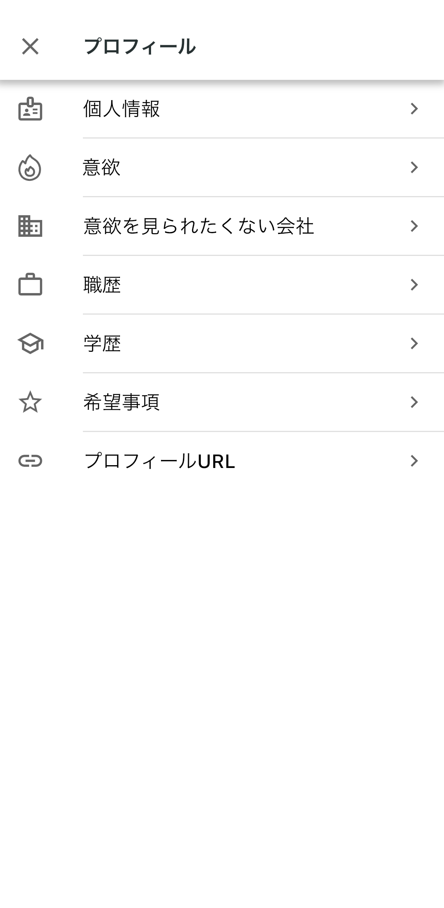
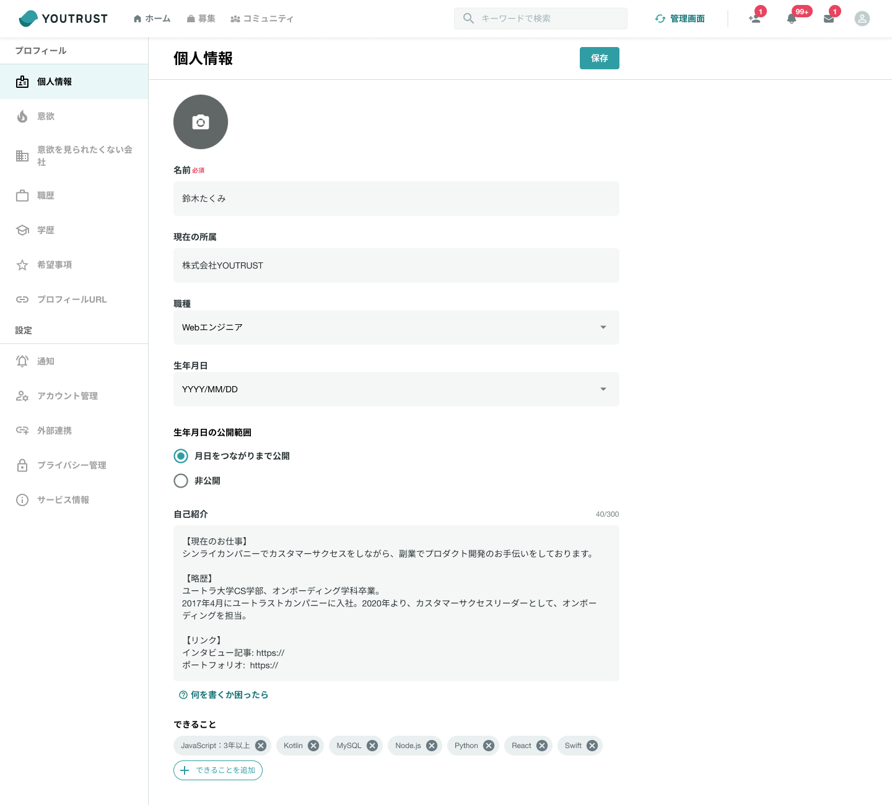

# :material-account-edit: プロフィールの追加や編集をしたい

## :material-cellphone: アプリ

ホーム＞自分のアイコンをタップ＞ 右上の✐マークをタップ＞編集したい項目をタップしてください。

{ width="300" }

{ width="300" }

## :material-monitor: Web

[マイページ](https://youtrust.jp/mypage?tab=profile)の所属コミュニティ下の「編集する」をクリックすると、以下のページに遷移します。編集したい項目を選択してください。

{ width="800" style="display: block; margin: 0 auto;" }

## :material-pencil: プロフィール設定項目(2024年9月時点)

| 項目                     | 内容                                                                                                                                                                                                                                                                              | 詳細ヘルプページ                                                                                                                                              |
| ------------------------ | --------------------------------------------------------------------------------------------------------------------------------------------------------------------------------------------------------------------------------------------------------------------------------- | ------------------------------------------------------------------------------------------------------------------------------------------------------------- |
| プロフィール写真         | プロフィールアイコンと背景写真を設定することができます。                                                                                                                                                                                                                          | [プロフィール写真を変更したい](./change-photo.md)                                                                                                             |
| 名前                     | ご自身のお名前をご登録ください。YOUTRUSTではフルネームでのご登録を推奨しております。                                                                                                                                                                                              |                                                                                                                                                               |
| 現在の所属               | 現在の所属です。正式名称でご登録ください。例. 株式会社YOUTRUST 複数設定することができます。 **グループ会社や親/子会社など正式名称が異なる場合には別所属とみなされ、意欲状況が公開されてしまいます。**公開したくない場合には、特定の企業に非公開にする設定を行ってください。 | [意欲を特定の企業に非公開にしたい](../privacy/hide-from-company.md)                                                                                           |
| 職種                     | 当てはまる職種を一つ選択できます。                                                                                                                                                                                                                                                | [職種追加の方法](./skills.md)                                                                                                                                 |
| 生年月日                 | 自分の生年月日を設定することができます。またその生年月日の公開範囲の設定が可能です。公開すると設定している場合でも「年」は表示されず、「月日」のみ公開となります。                                                                                                                | [生年月日について知りたい](./birthday.md)                                                                                                                     |
| 自己紹介                 | 自由に自己紹介を記入いただけます。ソーシャルアカウント連携できないポートフォリオやWebサイトのURLは、自己紹介の欄に入力してください。                                                                                                                                              |                                                                                                                                                               |
| できること               | 自分のスキルや特徴について、候補選択や任意で入力することができます。                                                                                                                                                                                                              | [「できること」について知りたい](./skills.md)                                                                                                                 |
| 副業意欲                 | 副業意欲を「積極的に探している」「検討している」「良い案件があれば」「考えていない」の4段階から選ぶことができます。 副業意欲は、現在の所属が同じ、または個別で設定した非公開にしたい企業所属のユーザーには公開されません。                                                     | [同僚に副業・転職意欲が公開されているのか知りたい](../privacy/colleague-visibility.md) [意欲を特定の企業に非公開にしたい](../privacy/hide-from-company.md) |
| 転職意欲                 | 転職意欲を「積極的に探している」「検討している」「良い案件があれば」「考えていない」の4段階から選ぶことができます。 転職意欲は、現在の所属が同じ、または個別で設定した非公開にしたい企業所属のユーザーには公開されません。                                                     | [同僚に副業・転職意欲が公開されているのか知りたい](../privacy/colleague-visibility.md) [意欲を特定の企業に非公開にしたい](../privacy/hide-from-company.md) |
| 職歴                     | 職歴や一緒に働いた人を追加することができます。複数の職歴や、「副業」「インターン」の職歴も入力することもできます。                                                                                                                                                                | [経歴を入力したい](./career.md)                                                                                                                               |
| 学歴                     | 学校名、学部・学科・専攻、開始年・終了年を入力することができます。複数入力可能です。                                                                                                                                                                                              |                                                                                                                                                               |
| 希望の働き方             | 希望の働き方を設定することができます。公式リクルーターのみ閲覧できます。                                                                                                                                                                                                          |                                                                                                                                                               |
| 希望の働く場所           | 希望の働く場所を設定することができます。公式リクルーターのみ閲覧できます。                                                                                                                                                                                                        |                                                                                                                                                               |
| ソーシャルアカウント連携 | XやGitHub、noteなど9種類のソーシャルアカウントと連携できます。                                                                                                                                                                                                                    | [各種SNSアカウントと連携したい](./link-sns.md)                                                                                                                |

---

### [【YOUTRUST】ログインはこちらから](https://youtrust.jp/)
