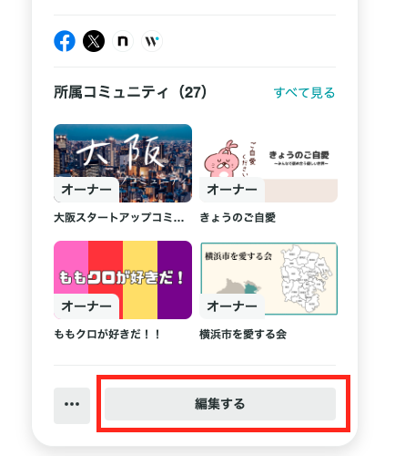

# プロフィールに記載いただきたい内容

## 登録時に記載いただきたい内容

### お名前

YOUTRUSTはフルネームで登録いただいております。
別途エンジニアの方などビジネスネームでのご登録をご希望の場合には、お名前のあとに括弧表記で記載いただくことが多いです。

### 所属企業

ご自身の所属企業の登録をお願いしております。
こちらにご登録いただくことで、所属企業が同じ方からご自身の意欲が閲覧できないような仕様になります。

※正式名称ではない登録、表記揺れがあると上記仕様が反映されなくなります。ご注意ください。

くわしくは[同僚に副業・転職意欲が公開されているのか知りたい](../privacy/colleague-visibility.md)をご覧ください。

## 入力の方法

プロフィール画面から、左カードの一番下＜編集する＞から編集が可能です。

基本情報から所属の入力・変更いただけます。

---

### :material-link: YOUTRUSTのログインは[こちら](https://youtrust.jp/)から
