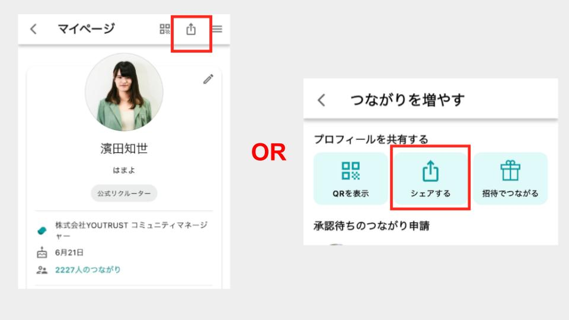

# :material-share-outline: プロフィールURLを共有したい

## :material-cellphone: アプリ

①ホーム＞右上の自分のアイコンをタップ＞ 右上の共有マークからリンクをコピー

②ホーム＞右上の人マークをタップ＞「シェアする」からリンクをコピー

## :material-monitor: Web

[マイページ](https://youtrust.jp/mypage?tab=profile)のURLをそのままコピー
