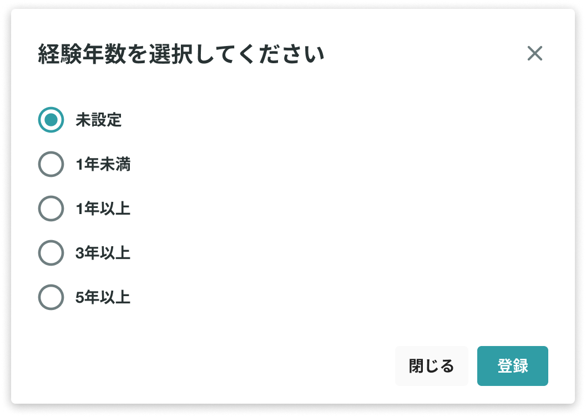

# 「できること」について知りたい

あなたに頼りたい企業・知り合い・友人が、YOUTRUSTであなたを発見する手がかりになるのが「できること」です。

入力が多いほど、あなたのスキルを見つけてもらいやすくなります。（平均６つの「できること」を入力しています）

## :material-cellphone: アプリ

ホーム＞自分のアイコン＞できることの右上の✐マーク

## :material-monitor: Web

[マイページ](https://youtrust.jp/mypage?tab=profile)から追加・編集ができます。

デフォルトで表示されている候補だけでなく、任意で入力することも可能です。

またWantedlyのアカウントと連携すると、Wantedlyに記入済の「できること」情報がインポートされ、YOUTRUSTのプロフィールに転記・追加することができます。

また設定したできることに経験年数を設定できるようになりました。（2023/12/20~）

